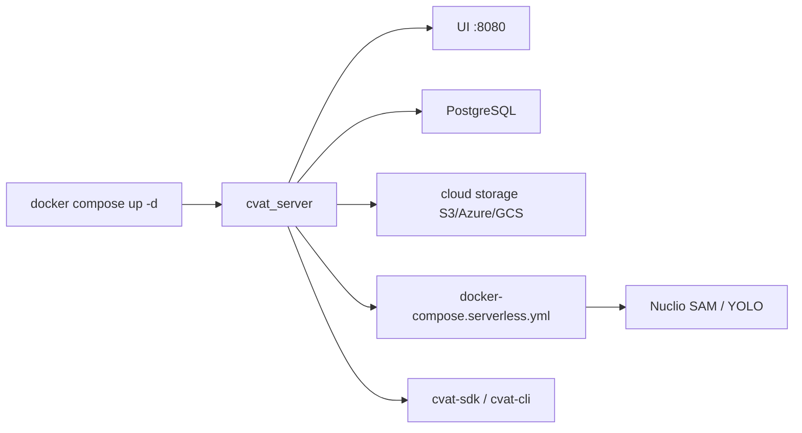

# cvat-ai/cvat

> Outil d'annotation vision auto-hébergé : images, vidéos, nuages de points 3D.

## Le problème
Annoter un dataset de détection ou de segmentation à plusieurs suppose un outil qui
gère les rôles, la revue, la qualité et vingt formats d'export — sinon c'est des
CSV et du Excel.

## Ce que ça fait vraiment
Boîtes, polygones, masques, keypoints, cuboïdes, tags. Organisation en projets →
tâches → jobs, assignation, suivi d'avancement, commentaires et issues. Contrôle
qualité par consensus, Ground Truth et Honeypot via l'API serveur. Export/import
dans 20+ formats (COCO, YOLO, Ultralytics, Pascal VOC, KITTI, MOT…), connexion S3 /
Azure / GCS. Pré-annotation automatique par modèles serverless Nuclio (SAM, YOLOv7,
RetinaNet, HRNet, TransT…). SDK Python `cvat-sdk` et CLI `cvat-cli`.

## Comment c'est branché


## Essayer
```bash
git clone https://github.com/cvat-ai/cvat
cd cvat
docker compose up -d
docker exec -it cvat_server bash -ic 'python3 ~/manage.py createsuperuser'
pip install cvat-sdk
```

## Coût et pièges
L'édition Community est MIT et gratuite, mais l'auto-labeling SAM 2/SAM 3, les
agents IA, le SSO, l'UI de contrôle qualité et les analytiques avancées sont
réservés aux offres payantes CVAT Online ou Enterprise. L'annotation automatique
Community exige de déployer Nuclio et `nuctl` en plus. Testé surtout sur Chromium ;
Safari/WebKit non supporté.

## Ce que ce n'est pas
Ce n'est pas un outil de labellisation texte ni tabulaire. La version gratuite n'est
pas la version démontrée sur le site : la frontière Community/Online est nette et il
faut la vérifier avant de promettre une fonctionnalité.

## Alternatives
- CVAT Online : le même produit en SaaS, pour éviter le déploiement.
- Labeling Services : externaliser l'annotation plutôt que la faire.

## Pour toi
Le standard de fait pour l'annotation vision auto-hébergée ; à retenir dès qu'un
projet CV a besoin d'un vrai atelier d'annotation.
