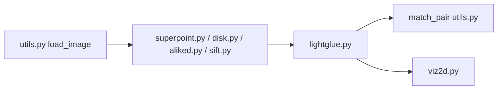

# cvg/LightGlue

> Réseau de neurones qui apparie des points clés locaux entre deux images, pour la vision 3D et la localisation.

## Le problème
Apparier rapidement des points entre images (reconstruction 3D, localisation visuelle) avec un coût variable selon la difficulté de la paire.

## Ce que ça fait vraiment
Prend les points et descripteurs de deux images et renvoie les indices des correspondances. Profondeur (couches) et largeur (points) s'adaptent à chaque paire grâce à un arrêt précoce et un élagage. Poids fournis pour SuperPoint, DISK, ALIKED et SIFT. Le dépôt contient l'inférence ; l'entraînement se fait avec glue-factory. Également disponible dans Hugging Face Transformers.

## Comment c'est branché


## Essayer
```bash
git clone https://github.com/cvg/LightGlue.git && cd LightGlue
python -m pip install -e .
python benchmark.py [--device cuda] [--add_superglue] [--num_keypoints 512 1024 2048 4096] [--compile]
```
Le README fournit aussi un script Python d'appariement (extractor + matcher).

## Coût et pièges
Gratuit. Les exemples utilisent `.cuda()` ; le CPU est possible mais plus lent (20 FPS à 512 points d'après le README). Les seuils d'élagage sont réglés pour des GPU RTX 30xx.

## Ce que ce n'est pas
Pas un pipeline complet de reconstruction : il n'apparie que des points déjà extraits. Les chiffres de vitesse viennent des auteurs.

## Alternatives
- SuperGlue : le prédécesseur comparé dans le benchmark.

## Pour toi
À surveiller : brique solide si tu fais de la vision 3D, hors sujet pour du texte ou du tabulaire ; dernier push en février 2026.

