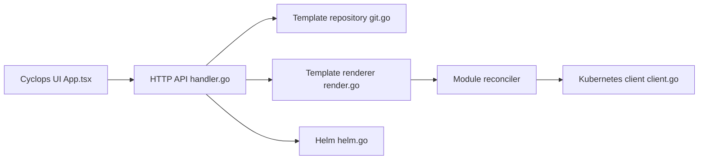

# cyclops-ui/cyclops

> Interface web pour déployer des applications Kubernetes à partir de charts Helm, sans écrire de YAML.

## Le problème
Les équipes non expertes de Kubernetes doivent éditer des manifestes YAML risqués pour déployer ou modifier une application.

## Ce que ça fait vraiment
Cyclops génère des formulaires d'interface à partir de templates (charts Helm) et déploie des « modules » dans le cluster. Un contrôleur réconcilie les modules en ressources Kubernetes. Le code expose aussi un magasin de templates (dépôt Git), la gestion des releases Helm, l'inspection de ressources, logs, exec dans un pod, et l'historique des modules. Un CLI `cyctl` existe.

## Comment c'est branché


## Essayer
```bash
kubectl apply -f https://raw.githubusercontent.com/cyclops-ui/cyclops/v0.21.1/install/cyclops-install.yaml && kubectl apply -f https://raw.githubusercontent.com/cyclops-ui/cyclops/v0.21.1/install/demo-templates.yaml
kubectl port-forward svc/cyclops-ui 3000:3000 -n cyclops
brew install cyctl
```
Puis http://localhost:3000.

## Coût et pièges
Gratuit, mais il faut un cluster Kubernetes et des prérequis listés à part (non détaillés ici). Le code contient un composant de télémétrie ; le README n'en parle pas. 84 issues ouvertes.

## Ce que ce n'est pas
Ni un outil de CI/CD ni un remplaçant d'Helm : il s'appuie dessus. Les formulaires ne valent que ce que valent les templates écrits. Les installations de production ne sont pas documentées dans le README.

## Alternatives
Le README cite Glasskube comme autre moyen d'installer, pas comme alternative fonctionnelle. Aucune autre alternative nommée.

## Pour toi
À surveiller : utile si tu exposes des déploiements d'outils MLOps à des collègues sans expertise Kubernetes, mais vérifie d'abord la télémétrie et la maturité.

