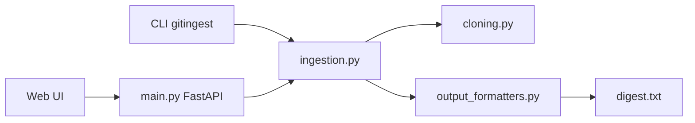

# cyclotruc/gitingest

> Transforme un dépôt Git ou un dossier en un seul texte prêt à coller dans un LLM.

## Le problème
Donner à un LLM le contexte d'un dépôt entier exige de copier des dizaines de fichiers à la main et de compter les tokens.

## Ce que ça fait vraiment
Produit un digest texte : arborescence, contenu des fichiers, statistiques (taille, nombre de tokens). Disponible en CLI, en package Python (sync et async), via un site web, et remplaçable dans une URL GitHub (`hub` par `ingest`). Les fichiers du `.gitignore` sont ignorés par défaut. Un dépôt privé demande un token GitHub.

## Comment c'est branché


## Essayer
```bash
pip install gitingest
gitingest /path/to/directory
gitingest https://github.com/coderamp-labs/gitingest
gitingest https://github.com/username/private-repo --token github_pat_...
```

## Coût et pièges
Gratuit. Le self-host prévoit PostHog et Sentry (variables d'environnement, Sentry envoie du PII par défaut à `true`). Un token GitHub est nécessaire pour le privé.

## Ce que ce n'est pas
Ce n'est pas un outil de recherche sémantique : il concatène, il ne résume pas. Un gros dépôt donne un digest qui dépasse la fenêtre de contexte.

## Alternatives
- Repomix : l'alternative NPM citée par le README, si tu préfères l'écosystème JavaScript.

## Pour toi
À adopter : une commande, aucun prérequis, et un gain net dès que tu donnes du code à un LLM ; vérifie tout de même la licence non déclarée.
