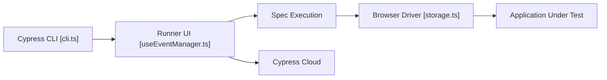

# cypress-io/cypress

> Outil de tests de bout en bout et de composants pour tout ce qui tourne dans un navigateur.

## Le problème
Les tests web classiques sont lents à écrire et instables.

## Ce que ça fait vraiment
README minimal (moins de 800 caractères, section « What is Cypress? » vide). L'architecture décrit : la CLI ouvre ou lance l'application, le runner choisit un spec, l'exécute via le pilote navigateur et rapporte les résultats. Des adaptateurs React, Vue, Angular, Svelte et des serveurs Vite/Webpack existent.

## Comment c'est branché


## Essayer
```bash
npm install cypress --save-dev
yarn add cypress --dev
pnpm add cypress --save-dev
```

## Coût et pièges
Le lanceur est gratuit ; les tarifs de Cypress Cloud ne sont pas documentés dans le README.

## Ce que ce n'est pas
Ce n'est pas un outil de test unitaire ni de test de modèles. Fiche minimale : le reste (commandes, options) n'est pas dans le README.

## Alternatives
Aucune alternative nommée dans le README.

## Pour toi
À surveiller : utile seulement si tu testes une interface web de ton produit IA ; sans cela hors périmètre.

