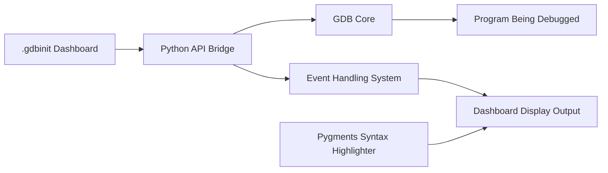

# cyrus-and/gdb-dashboard

> Fichier `.gdbinit` qui affiche un tableau de bord modulaire dans GDB, pour développeurs C/C++.

## Le problème
Inspecter l'état d'un programme sous GDB demande d'enchaîner beaucoup de commandes à chaque arrêt.

## Ce que ça fait vraiment
Un seul `.gdbinit` écrit avec l'API Python de GDB affiche automatiquement un tableau de bord à chaque arrêt du programme.
Aucune commande GDB redéfinie : tout passe par la commande `dashboard`.
Coloration syntaxique optionnelle via Pygments.
Documentation détaillée sur le wiki.

## Comment c'est branché


## Essayer
```bash
wget -P ~ https://github.com/cyrus-and/gdb-dashboard/raw/master/.gdbinit
pip install pygments
```

## Coût et pièges
Gratuit, rien à configurer ; remplace ton `~/.gdbinit` existant, à fusionner si tu en as un.

## Ce que ce n'est pas
Pas un débogueur graphique ni un IDE : c'est une surcouche texte de GDB.
Inutile pour du Python ou du code ML haut niveau.

## Alternatives
Aucune alternative nommée dans le README.

## Pour toi
À ignorer : pertinent seulement si tu débogues des extensions C/C++ ou CUDA natives, rare dans un quotidien data/MLOps.
