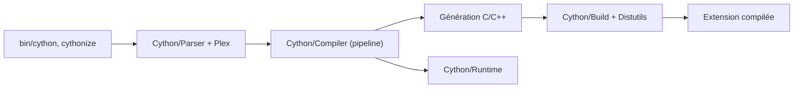

# cython/cython

> Compilateur qui traduit du Python (avec types C) en C/C++ pour accélérer du code ou envelopper des bibliothèques C.

## Le problème
Le Python pur est lent sur les boucles numériques, et l'écriture d'extensions C à la main est pénible.

## Ce que ça fait vraiment
Le compilateur analyse le code (`Cython/Parser`, `Plex`), applique un pipeline de transformations et d'inférence de types (`Cython/Compiler`), puis génère du C ou du C++ compilé en extension CPython. Il offre aussi des outils de build (`cythonize`, Distutils), un débogueur et des en-têtes pour les API C. Il appelle directement des fonctions C.

## Comment c'est branché


## Essayer
```bash
pip install Cython
```

## Coût et pièges
Gratuit, mais il faut un compilateur C. Le README ne détaille pas plus l'usage ; tout passe par la documentation en ligne.

## Ce que ce n'est pas
Pas un compilateur JIT : le code est compilé en amont. Le README compare lui-même avec PyPy, Numba, Pythran, mypyc et Nuitka, et ne prétend pas que Cython les remplace toujours.

## Alternatives
Numba (JIT pour du code NumPy), PyPy (runtime avec JIT), Pythran (numérique, souvent utilisé en backend de Cython), mypyc, Nuitka.

## Pour toi
À adopter : c'est la brique derrière une grande partie de l'écosystème scientifique Python, et la connaître sert à accélérer un goulot ou à envelopper une bibliothèque C.

