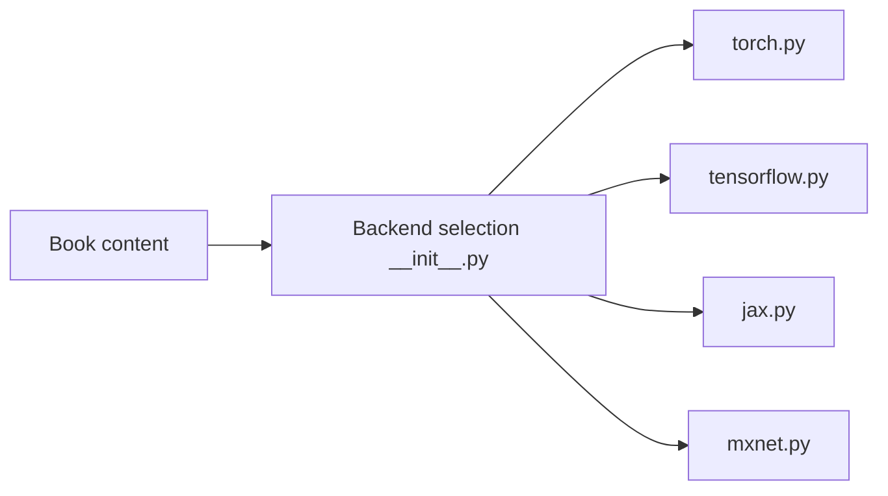

# d2l-ai/d2l-en

> Manuel interactif de deep learning en anglais, notebooks multi-frameworks, pour étudiants et praticiens.

## Le problème
Les cours de deep learning séparent théorie, maths et code. Ce livre les réunit dans des notebooks exécutables.

## Ce que ça fait vraiment
Le livre est rédigé en notebooks Jupyter mêlant exposés, figures, maths et code autonome. Contenu : bases, entraînement, vision, modèles de langage, sujets avancés, annexes de maths et d'outils. Quatre modules d'aide (PyTorch, TensorFlow, JAX, MXNet) offrent des API parallèles. Un forum accompagne le livre.

## Comment c'est branché


## Essayer
```bash
# Aucune commande documentée dans ce README :
# lecture sur le site du livre, notebooks dans le dépôt.
```

## Coût et pièges
Gratuit. Licence présente mais non identifiée par GitHub. Dernier push en août 2024. Versions de frameworks requises non documentées.

## Ce que ce n'est pas
Ce n'est pas un paquet à installer en production : les helpers servent uniquement aux exemples du livre.

## Alternatives
- d2l-ai/d2l-zh : l'édition chinoise du même livre.

## Pour toi
Surveiller : référence d'apprentissage reconnue, mais dépôt inactif depuis 2024 et licence à vérifier avant réutilisation.

