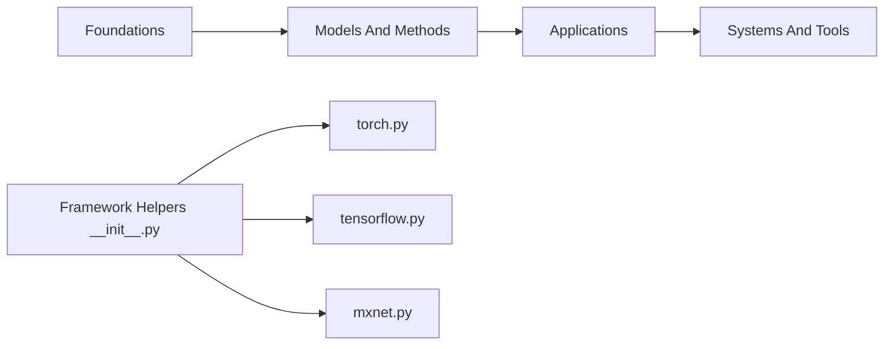

# d2l-ai/d2l-zh

> Manuel libre de deep learning en chinois, avec code exécutable, pour étudiants et ingénieurs.

## Le problème
Apprendre le deep learning oblige à jongler entre cours théoriques, maths et code épars. Ce manuel réunit concepts, maths et implémentation au même endroit.

## Ce que ça fait vraiment
Un livre (2e édition sur zh.D2L.ai) dont chaque chapitre mêle texte, formules et code. Les chapitres vont des bases (réseaux linéaires, perceptrons multicouches) aux CNN, RNN, attention/Transformers, puis vision, langage, performance et déploiement. Une couche d'helpers `d2l` propose des adaptateurs PyTorch, TensorFlow, MXNet et Paddle. Un forum complète le livre.

## Comment c'est branché


## Essayer
```bash
# Aucune commande documentée dans ce README :
# lecture en ligne sur zh.D2L.ai (2e édition) ou zh-v1.D2L.ai (1re édition).
```

## Coût et pièges
Lecture gratuite. Le README ne dit rien des prérequis matériels pour exécuter le code. Dernier push en juillet 2024.

## Ce que ce n'est pas
Ce n'est pas une bibliothèque à installer : les helpers `d2l` ne servent qu'aux exemples du livre. Le README annonce que les nouvelles versions s'écrivent en anglais puis reviennent en chinois : cette version suit donc avec retard.

## Alternatives
- d2l-ai/d2l-en : l'édition anglaise, où le contenu neuf est désormais écrit.

## Pour toi
Surveiller : excellent support d'apprentissage si tu lis le chinois, mais le dépôt est figé depuis 2024 et l'édition anglaise prime pour le contenu récent.

