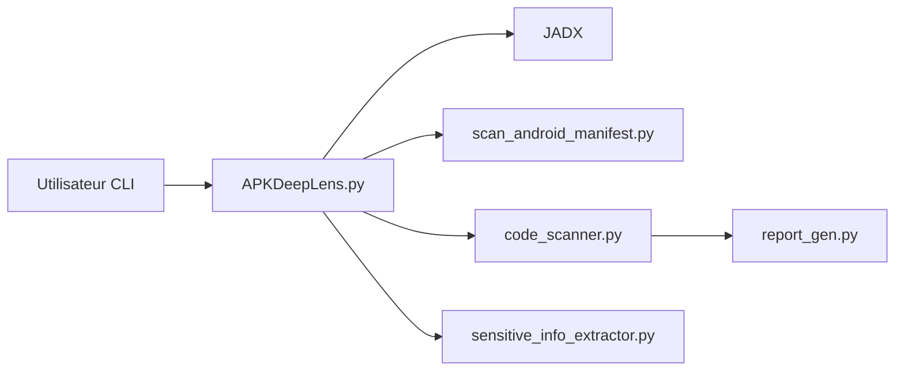

# d78ui98/APKDeepLens

> Analyseur statique d'APK Android qui détecte des failles selon l'OWASP Mobile Top 10.

## Le problème
Auditer manuellement un APK (manifeste, secrets en dur, mauvaise configuration TLS) est long et inégal.

## Ce que ça fait vraiment
Décompile l'APK avec JADX, analyse le manifeste et le code Java/Kotlin/XML, cherche secrets, URLs non sécurisées, crypto faible, WebView, SSL, exécution dynamique. Chaque résultat porte une sévérité et une catégorie OWASP, exportés en JSON, HTML, PDF ou TXT, avec une sortie JSON pensée pour la CI.

## Comment c'est branché


## Essayer
```bash
git clone https://github.com/d78ui98/APKDeepLens.git
cd APKDeepLens
python3 -m venv venv
source venv/bin/activate
pip install -r requirements.txt
python APKDeepLens.py -apk app.apk -report html
```

## Coût et pièges
Gratuit ; Python 3.10+ et Java requis. Un scan statique par motifs produit des faux positifs ; une liste de filtrage est fournie.

## Ce que ce n'est pas
Pas d'analyse dynamique. Ne remplace pas un test d'intrusion.

## Alternatives
Aucune alternative citée dans le README.

## Pour toi
À ignorer : sécurité mobile hors périmètre data/IA ; utile uniquement si tu audites des applications Android.

