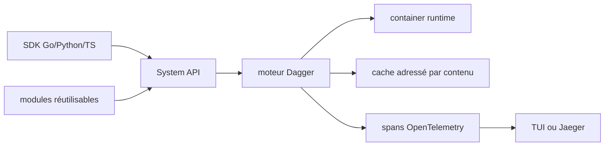

# dagger/dagger

> Moteur d'automatisation de livraison logicielle où les étapes sont du code typé, pas du YAML.

## Le problème
Un pipeline CI écrit en YAML propriétaire ne se teste qu'en poussant sur le serveur,
et ne se rejoue pas à l'identique en local.

## Ce que ça fait vraiment
Fournit un moteur d'exécution et une API système multi-langage pour orchestrer
conteneurs, systèmes de fichiers, secrets, dépôts Git et tunnels réseau, chaque
opération typée et composable. SDK natifs pour Go, Python, TypeScript, PHP, Java,
.NET, Elixir et Rust, tous générés depuis le schéma d'API. Types d'artefacts
personnalisés à état encapsulé, adressés par contenu, transmissibles entre langages
et entre modules sans sérialisation. Exécution incrémentale : chaque opération est
clé-valuée par ses entrées, le cache est adressé par contenu et vaut pour le local
comme pour la CI. Chaque opération émet des spans OpenTelemetry, avec TUI en direct
ou export vers Jaeger, Honeycomb ou tout backend OTel.

## Comment c'est branché


## Essayer
```bash
brew install dagger/tap/dagger
```

## Coût et pièges
Gratuit, seule dépendance un runtime de conteneurs Linux (Docker Desktop sur macOS
et Windows). Le README ne détaille ni l'offre cloud ni ce qu'elle facture, alors
qu'il mentionne une exécution « directement dans le cloud ».

## Ce que ce n'est pas
Pas un serveur CI : il s'exécute dans votre CI existante, il ne la remplace pas.
Pas de mode sans conteneurs. Le README est un argumentaire, pas un guide : une seule
commande y figure, tout le reste renvoie au Quickstart.

## Alternatives
- Aucun dépôt alternatif nommé dans le README.

## Pour toi
Intéressant pour rendre un pipeline de données rejouable à l'identique en local ;
le coût d'apprentissage est réel. Surveiller.
