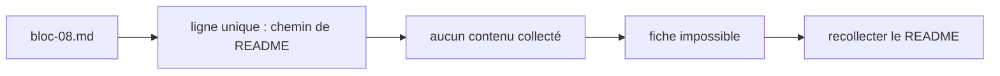

# dagster-io/dagster

> Dépôt non lu : le bloc ne contient aucun contenu de README exploitable.

## Le problème
Non documenté ici.

## Ce que ça fait vraiment
**Aucune synthèse possible.** Le bloc `bloc-08.md` ne contient, pour ce dépôt, que
la ligne `python_modules/dagster/README.md` — un chemin de fichier, pas son contenu.
Le README n'a donc pas été collecté et rien ne peut être décrit sans inventer.

## Comment c'est branché

## Essayer
Aucune commande documentée : le contenu du README est absent du bloc.

## Coût et pièges
Non documenté ici.

## Ce que ce n'est pas
Ce n'est pas une fiche : c'est un signalement. Le pipeline a manifestement suivi un
renvoi de README vers `python_modules/dagster/README.md` sans en récupérer le
contenu. À recollecter avant de pouvoir juger le dépôt.

## Alternatives
Non documenté ici.

## Pour toi
Rien à trancher tant que le README n'est pas récupéré.
