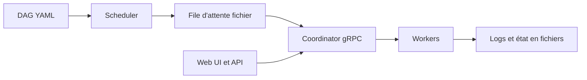

# dagu-org/dagu

> Moteur de workflows local en binaire unique, pour automatiser des scripts sans plateforme lourde.

## Le problème
Cron n'offre ni dépendances, ni reprises, ni historique ; Airflow ou Temporal imposent une plateforme ou un SDK.

## Ce que ça fait vraiment
Les DAG s'écrivent en YAML : commandes shell, conteneurs Docker, Jobs Kubernetes, SSH, HTTP, SQL, dbt, DuckDB. Planification cron avec rattrapage, retries, tâches humaines, secrets masqués, sous-DAG parallèles, interface web, serveur MCP intégré. Exécution en serveur unique ou avec workers gRPC ; état en fichiers, sans base.

## Comment c'est branché


## Essayer
```sh
brew install dagu
dagu start hello.yaml
dagu start-all --dags .
docker run --rm -v ~/.dagu:/var/lib/dagu -p 8080:8080 ghcr.io/dagucloud/dagu:latest dagu start-all
```

## Coût et pièges
Gratuit en communauté. Une licence self-host ajoute SSO, RBAC, audit et intégration incident. Monter le socket Docker donne le contrôle de l'hôte aux workflows.

## Ce que ce n'est pas
Pas un remplaçant d'Airflow pour de gros pipelines de données à échelle plateforme : le README parle de milliers de runs par jour sur une machine. Build workflows: locaux uniquement.

## Alternatives
- Airflow : préférable si tu as déjà une plateforme et un parc de DAG Python.
- Temporal : préférable si tu veux de l'exécution durable dans le code applicatif.

## Pour toi
À adopter : YAML et un seul binaire pour orchestrer ETL, dbt ou inférence locale sans exploiter six services ; vérifie la licence, non déclarée.
