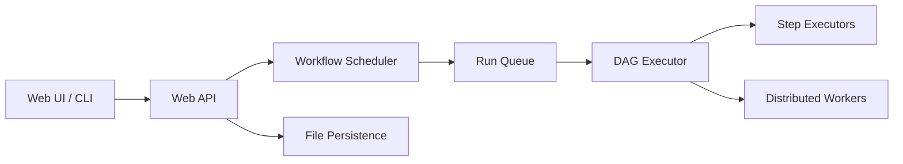

# dagucloud/dagu

> Moteur de workflows en binaire unique, défini en YAML, pour automatiser scripts et tâches d'exploitation.

## Le problème
Cron ne gère ni dépendances, ni reprises, ni historique. Airflow ou Temporal demandent une plateforme entière ou de réécrire ses jobs dans leur SDK.

## Ce que ça fait vraiment
Un fichier YAML décrit étapes, dépendances, réessais, planification (cron, fuseaux, rattrapage) et tâches humaines. Chaque étape lance une commande shell, un conteneur Docker, un Job Kubernetes, du SSH, du SQL, du HTTP ou une action officielle (dbt, DuckDB, ffmpeg…). L'état est stocké dans des fichiers, sans base ni broker. Une UI web, une API REST et un serveur MCP intégré sont fournis. L'exécution peut être répartie sur des workers via un coordinateur gRPC.

## Comment c'est branché


## Essayer
```bash
brew install dagu
dagu start hello.yaml
dagu start-all --dags .
docker run --rm -v ~/.dagu:/var/lib/dagu -p 8080:8080 ghcr.io/dagucloud/dagu:latest dagu start-all
```
Le fichier `hello.yaml` contient une étape `run: echo "hello from Dagu"`.

## Coût et pièges
La version communautaire est gratuite ; une licence « self-host » ajoute SSO, RBAC, audit et intégration d'incidents. Monter le socket Docker donne aux workflows le contrôle de l'hôte. Le README recommande l'authentification `builtin` et prévient d'un défaut de routage des notifications en v2.11.0 à v2.11.2. Les installeurs `curl | bash` sont à lire avant.

## Ce que ce n'est pas
Ce n'est pas un orchestrateur de données au sens d'Airflow : pas de notion native d'actifs. L'API Go embarquée est expérimentale. Le passage à l'échelle repose sur des fichiers partagés.

## Alternatives
- Airflow : à préférer pour un écosystème d'opérateurs data et de gros volumes, au prix d'une plateforme à exploiter.
- Temporal : à préférer pour de l'exécution durable dans le code applicatif.

## Pour toi
À adopter pour automatiser ETL, dbt et scripts sans monter de plateforme : un binaire et du YAML suffisent, et les fonctions payantes restent optionnelles.
