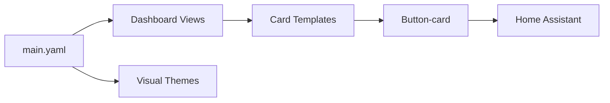

# damianeickhoff/HaCasa

> Ancien tableau de bord minimaliste pour Home Assistant, archivé, construit avec Button-card.

## Le problème
Les tableaux de bord Home Assistant par défaut sont peu soignés et pénibles à personnaliser pour un foyer.

## Ce que ça fait vraiment
Le dépôt contient une configuration de dashboard (`main.yaml`), des vues, des modèles de cartes Button-card, des thèmes et des images. L'auteur visait une interface sobre, personnalisable et acceptable pour tout le foyer. Aucune commande d'installation n'est documentée.

## Comment c'est branché

## Essayer
Aucune commande documentée dans le README.

## Coût et pièges
Gratuit, mais archivé : aucune mise à jour, issue ou PR acceptée. Suppose une instance Home Assistant et Button-card.

## Ce que ce n'est pas
Pas maintenu, et sans rapport avec la data ou l'IA. Le README sert de mémoire du projet.

## Alternatives
Button-card (RomRaider) : la base sur laquelle sont faites les cartes.

## Pour toi
À ignorer : dépôt archivé et hors de ton profil data/IA/MLOps ; ne servirait que d'inspiration pour Home Assistant.

