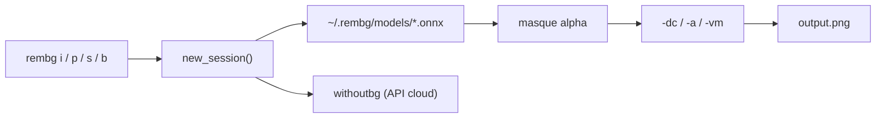

# danielgatis/rembg

> Détourage d'images en ligne de commande ou en Python, pour qui traite des lots d'images.

## Le problème
Détourer une image à la main coûte des minutes ; un lot de mille images coûte des jours.
Les services en ligne facturent à l'image et exigent d'envoyer les fichiers dehors.

## Ce que ça fait vraiment
Une CLI à six sous-commandes : `i` (un fichier), `p` (un dossier, avec mode `-w` qui surveille),
`s` (serveur HTTP + API), `b` (flux RGB24 depuis FFmpeg), `d` (pré-téléchargement), `m` (migration).
Les modèles ONNX sont téléchargés au premier usage sous `~/.rembg/models/`. Quatre modes de bord :
naïf, `-dc` (décontamination couleur), `-a` (alpha matting), `-vm` (ViTMatte, ~110 Mo de plus).

## Comment c'est branché


## Essayer
```bash
rembg i path/to/input.png path/to/output.png
rembg i -m u2netp path/to/input.png path/to/output.png
rembg p -w path/to/input path/to/output
rembg s --host 0.0.0.0 --port 7000 --log_level info
docker run -v .:/data danielgatis/rembg i /data/input.png /data/output.png
```

## Coût et pièges
Le modèle par défaut `bria-rmbg` pèse ~1,02 Go et tourne en 1024×1024 : plus lent qu'`u2net`.
RMBG-2.0 est sous licence BRIA, qui exige un accord payant pour un usage commercial — la licence MIT
de rembg ne couvre pas les poids. L'image Docker CUDA se construit soi-même et occupe ~11 Go.

## Ce que ce n'est pas
Pas un éditeur : aucun rattrapage manuel du masque. Pas une garantie de qualité sur les cheveux —
`-a` peut ne pas converger, rembg bascule alors sur un rendu décontaminé. Le backend `withoutbg`
envoie les images sur des serveurs tiers (20 Mo max), ce n'est plus du local.

## Alternatives
- `sam` : segmentation pilotée par points, si le sujet doit être désigné.
- `birefnet-portrait` : recommandé par le README pour les portraits, avec `-dc`.
- `isnet-anime` : pour les personnages dessinés, là où les modèles généraux échouent.

## Pour toi
Le seul détoureur local sérieux pour un pipeline batch : à installer, mais passe à `-m u2net` si le débit compte.
