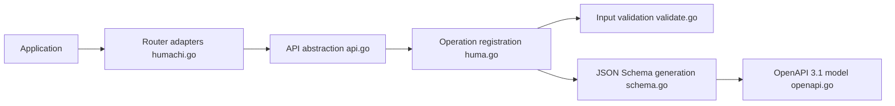

# danielgtaylor/huma

> Micro-framework Go pour API REST/RPC décrites en OpenAPI 3.1 et JSON Schema, inspiré de FastAPI.

## Le problème
Garder la documentation d'API synchronisée avec le code Go sans écrire les schémas à la main.

## Ce que ça fait vraiment
Tu déclares des opérations typées ; Huma lie paramètres et corps, valide, appelle le handler, sérialise (JSON, CBOR en option) et renvoie des erreurs RFC 9457. Il génère OpenAPI et schémas JSON par réflexion, et s'installe sur ton routeur (Chi, mux standard, Gin, Echo, Fiber…) via des adaptateurs. PATCH automatique, SSE et CLI intégrée disponibles.

## Comment c'est branché


## Essayer
```bash
go get -u github.com/danielgtaylor/huma/v2
go run greet.go
restish :8888/greeting/world
```

## Coût et pièges
Gratuit. Go 1.25 ou plus requis. 132 issues ouvertes, mainteneur principal unique.

## Ce que ce n'est pas
Ce n'est pas un serveur : tu gardes le tien. Les témoignages du README sont des avis d'utilisateurs, pas des mesures.

## Alternatives
- FastAPI : l'inspiration, en Python.

## Pour toi
À surveiller : à retenir si tu sers des modèles en Go avec une spécification OpenAPI ; en Python, FastAPI reste plus direct.

