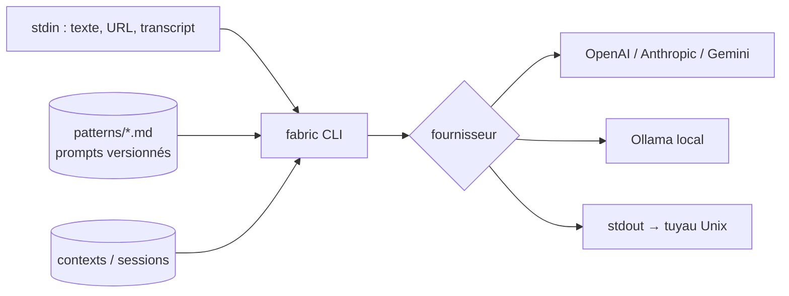

# danielmiessler/fabric

> **Une bibliothèque de prompts éprouvés, utilisable en ligne de commande dans un tuyau Unix.**

## Le problème

Les bons prompts se perdent : ils vivent dans des onglets de chat, des notes, la mémoire de
celui qui les a écrits. Résultat, on réécrit le même prompt de résumé pour la centième fois,
en moins bon, et on ne peut ni le versionner ni le partager ni l'enchaîner avec autre chose.

## Ce que ça fait vraiment

Fabric n'est **pas** un modèle ni une interface de chat. C'est deux choses :

1. **Un dépôt de « patterns »** — des prompts système longs, écrits et affûtés à la main,
   rangés par tâche réelle : `summarize`, `extract_wisdom`, `analyze_claims`,
   `write_essay`… Ce sont de simples fichiers markdown, lisibles et modifiables.
2. **Un binaire Go** qui prend une entrée sur `stdin`, y applique un pattern, et envoie le
   tout au fournisseur de ton choix. D'où la vraie idée : le LLM devient une commande Unix
   qu'on peut mettre dans un tuyau, une boucle, un cron.

Il gère aussi les sessions (mémoire de conversation), les contextes (des préambules
réutilisables), un serveur REST, et la transcription YouTube en entrée.

## Comment c'est branché



## Essayer

```bash
curl -fsSL https://raw.githubusercontent.com/danielmiessler/fabric/main/scripts/installer/install.sh | bash
fabric --setup                       # choix du fournisseur et des clés
pbpaste | fabric -p summarize        # ou : cat note.md | fabric -p extract_wisdom
fabric -y "https://youtu.be/..." -p extract_wisdom   # transcript YouTube en entrée
```

Installé par Homebrew ou pacman, le binaire s'appelle `fabric-ai` : prévoir un alias.

## Ce qu'il faut avoir

- Une clé d'API chez un fournisseur — **le coût des appels est pour toi**, Fabric n'héberge rien.
- Ou un Ollama local, ce qui rend l'ensemble gratuit et hors ligne, avec des patterns longs
  qui demandent un modèle correct pour donner quelque chose.

## Ce que ce n'est pas

- **Pas un framework d'agents.** Aucune boucle d'outils, aucune exécution, aucun état
  au-delà des sessions. Un pattern = un appel. Comparer avec LangChain ou un serveur MCP
  est un contresens.
- **La valeur est dans les prompts, pas dans le code.** Le binaire est un lanceur ; on peut
  se servir des patterns sans jamais installer Fabric, et c'est un usage légitime.
- Le README est bavard et militant (« human flourishing »), l'outil est en réalité très
  simple. Ne pas confondre l'ambition affichée avec le périmètre réel.

## Alternatives

| | Quand le préférer |
|---|---|
| **Copier les patterns à la main** | Tu ne veux qu'un bon prompt de résumé, pas un binaire de plus. |
| **llm (Simon Willison)** | Même philosophie Unix, plus sobre, écosystème de plugins Python, pas de bibliothèque de prompts fournie. |
| **Un skill Claude Code** | Si le travail doit lire des fichiers, lancer des commandes et boucler — Fabric ne fait rien de tout ça. |

## Pour toi

Intéressant pour **la bibliothèque de patterns**, pas pour le binaire : `extract_wisdom` et
`analyze_paper` sont directement pillables pour tes skills de veille et de doc. L'outil
lui-même fait doublon avec ce que Claude Code fait déjà chez toi, en moins bien intégré.
