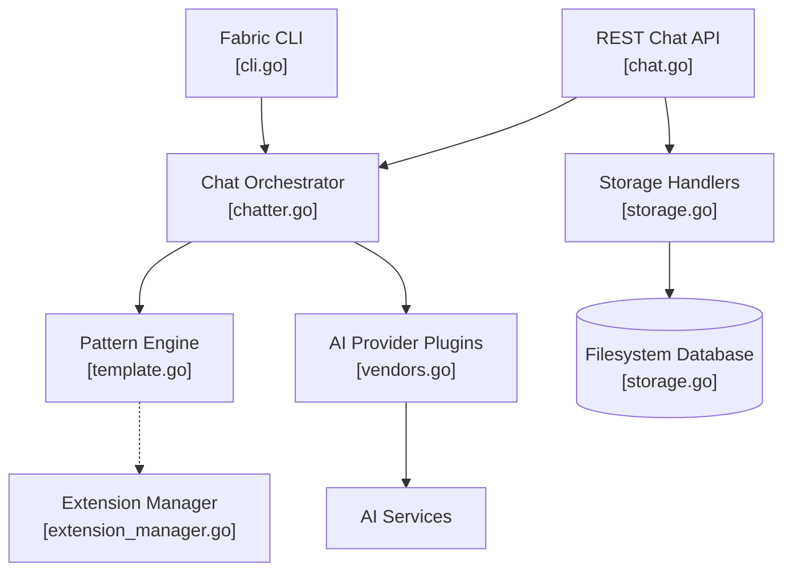

# danielmiessler/fabric

> Outil en ligne de commande qui organise des prompts réutilisables, appelés Patterns.

## Le problème
Les prompts utiles s'éparpillent entre notes, onglets et historiques de chat : impossible de
savoir lesquels sont bons, ni de les versionner.

## Ce que ça fait vraiment
Range les prompts en Patterns appelables par `fabric --pattern <nom>`, avec variables, contextes
et sessions persistés dans une base sur le système de fichiers.
Tire l'entrée d'un fichier, du presse-papier, d'une URL scrapée via Jina AI, d'une vidéo YouTube
(transcript, commentaires, métadonnées, OCR des images) ou d'un podcast Spotify.
Parle à de nombreux fournisseurs (Anthropic, OpenAI, Gemini, Ollama, Azure, Bedrock…), avec un modèle
assignable par Pattern. Expose une API REST (`--serve`), un mode compatible Ollama et une UI web.

## Comment c'est branché


## Essayer
```bash
curl -fsSL https://raw.githubusercontent.com/danielmiessler/fabric/main/scripts/installer/install.sh | bash
go install github.com/danielmiessler/fabric/cmd/fabric@latest
fabric --setup
fabric -h
docker run --rm -it kayvan/fabric:latest --version
```

## Coût et pièges
L'outil est gratuit, les modèles non : chaque Pattern consomme ta clé d'API. Homebrew et AUR
installent la commande sous le nom `fabric-ai`, il faut un alias. `--setup` est obligatoire, y compris
après migration depuis l'ancienne version Python. Les variables `GOROOT`/`GOPATH` sont à poser à la main.

## Ce que ce n'est pas
Ce n'est pas un modèle ni un agent autonome : il envoie un prompt et rend une réponse.
Ce n'est pas un gestionnaire de workflow : les Patterns s'enchaînent par le shell, pas par un graphe.
Les Patterns livrés sont des textes, leur qualité varie et rien ne les évalue.

## Alternatives
Aucune alternative nommée dans le README.

## Pour toi
Le bon endroit où ranger tes prompts de veille et de résumé pour les rejouer sans les réécrire.
