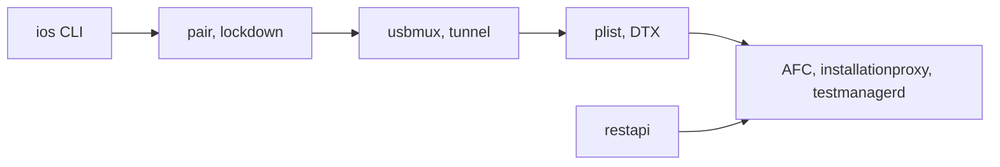

# danielpaulus/go-ios

> CLI Go multiplateforme pour automatiser des appareils iOS depuis Linux, Windows ou macOS.

## Le problème
Piloter un iPhone (installer, lancer, tester, déboguer) sans Mac ni Xcode.

## Ce que ça fait vraiment
Une seule commande `ios` avec sortie JSON couvre installation d'apps, lancement, XCTest et WebDriverAgent, captures d'écran, fichiers, logs, profils, simulation de localisation, réseau, images développeur. Sous le capot : découverte et appairage, transport usbmux/lockdown et tunnel pour iOS 17+, codecs Apple (plist, XPC, DTX, NSKeyedArchiver), puis un client par service. Une API REST expérimentale existe.

## Comment c'est branché


## Essayer
```bash
npm install -g go-ios
ios --help
sudo ios tunnel start
ios list
ios install --path=/path/to/app
```

## Coût et pièges
Gratuit. iOS 17+ exige un daemon de tunnel lancé en administrateur ; sous Windows, il faut copier `wintun.dll`.

## Ce que ce n'est pas
Pas un outil de test complet : il exécute des XCTest mais ne les écrit pas. L'API REST reste expérimentale.

## Alternatives
Aucune alternative nommée dans le README.

## Pour toi
À ignorer sauf si tu automatises des tests mobiles iOS ; peu de lien avec données ou MLOps.

