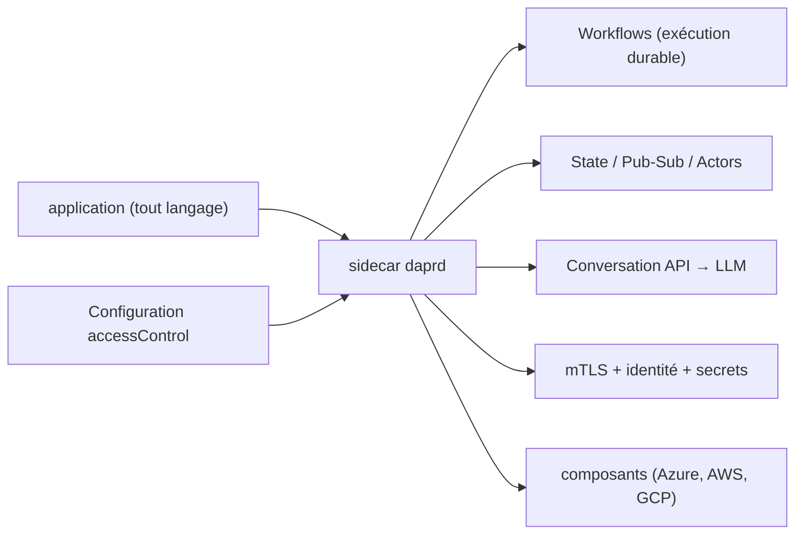

# dapr/dapr

> Runtime sidecar qui fournit exécution durable, état, messagerie et sécurité à toute application.

## Le problème
Un traitement long qui plante repart de zéro : rien ne persiste la progression sans écrire sa propre machine à états.
Chaque langage et chaque cloud imposent une plomberie différente pour l'état, la messagerie et les secrets.

## Ce que ça fait vraiment
Tourne en sidecar : toutes les capacités sont accessibles en HTTP et gRPC depuis n'importe quel langage.
Les Workflows persistent automatiquement la progression et reprennent à l'étape suivante après crash, redémarrage de pod ou panne de nœud.
Blocs à la carte : invocation de service (mTLS, retries), état, pub/sub, acteurs, Conversation (LLM avec cache de prompt et appels d'outils), secrets, verrous, cryptographie, jobs.
Identité cryptographique par application, mTLS partout, politiques d'accès en YAML, et exécution vérifiable (origine, lignage, intégrité de l'historique).

## Comment c'est branché

## Essayer
Aucune commande d'installation n'est écrite dans le README : il renvoie au guide « Getting Started » de la documentation et au dépôt de quickstarts. Seul un exemple de politique d'accès YAML est fourni.

## Coût et pièges
Gratuit ; binaire d'environ 58 Mo consommant ~4 Mo de mémoire, adoptable API par API.
Les composants (state stores, brokers) restent des services tiers à provisionner et à payer.

## Ce que ce n'est pas
Ce n'est pas un framework applicatif : pas de dépendance dans ton code, l'adoption se fait par appels HTTP/gRPC.
Ce n'est pas un framework d'agent : il fournit les primitives d'exécution et fonctionne à côté de ton framework IA.
Ce n'est pas réservé à Kubernetes : machines virtuelles, edge et déploiements isolés sont couverts.

## Alternatives
Aucune alternative nommée dans le README.

## Pour toi
À connaître si tes agents doivent survivre aux redémarrages en production ; surdimensionné pour un prototype.
