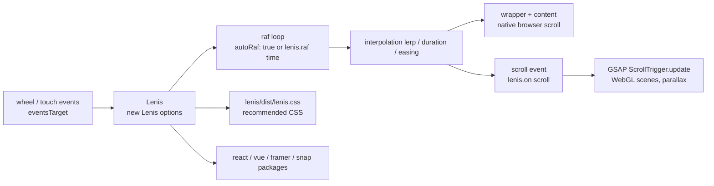

# darkroomengineering/lenis

> **Smooth scrolling for websites, for front-end developers syncing animations to scroll position.**

## The problem

Native browser scrolling advances in discrete jumps, which makes WebGL scenes, parallax and
scroll-driven animations look choppy. Hand-rolled replacements usually break `position: sticky`,
anchor links and accessibility, because they throw away the browser's own scroll instead of
wrapping it.

## What it actually does

Lenis wraps native scroll rather than replacing it: per the README, `position: sticky`, anchor
links and accessibility keep working. It interpolates the scroll position frame by frame in a
`requestAnimationFrame` loop that you can leave to Lenis (`autoRaf: true`) or drive yourself by
calling `lenis.raf(time)`.

Behaviour is set through options: `lerp` (default 0.1) or `duration`/`easing` for smoothing,
`orientation` and `gestureOrientation` for the axis (vertical, horizontal, `both`), `infinite`
for endless scroll, `syncTouch` for touch devices, `anchors` for anchor links, and
`allowNestedScroll` or the `data-lenis-prevent` HTML attribute for nested containers.
`respectReducedMotion` defaults to `true`: when the user asks for reduced motion, `lerp` is
forced to `1` and programmatic scrolls jump instantly.

The instance exposes `scrollTo(target, options)`, `start()`, `stop()`, `resize()`, `destroy()`,
per-frame properties (`scroll`, `velocity`, `progress`, `direction`, `isScrolling`) and two
events, `scroll` and `virtual-scroll`. Syncing with GSAP ScrollTrigger is documented explicitly.
The repository also ships `lenis/react`, `lenis/vue`, `lenis/framer` and `lenis/snap` (section
snapping).

## How it is wired



No code-derived diagram exists for this repository: this one is rebuilt from the README alone,
from the option, method and package names it documents.

## Trying it

```bash
npm i lenis
# or
yarn add lenis
# or
pnpm add lenis
```

Then the minimal setup given by the README:

```js
import Lenis from 'lenis'
import 'lenis/dist/lenis.css'

// Initialize Lenis
const lenis = new Lenis({
  autoRaf: true,
});

// Listen for the scroll event and log the event data
lenis.on('scroll', (e) => {
  console.log(e);
});
```

With no build step, the README gives a CDN route:

```html
<link rel="stylesheet" href="https://unpkg.com/lenis@1.3.26/dist/lenis.css">
<script src="https://unpkg.com/lenis@1.3.26/dist/lenis.min.js"></script> 
<script>new Lenis({ autoRaf: true, autoToggle: true, anchors: true, allowNestedScroll: true, naiveDimensions: true, stopInertiaOnNavigate: true })</script>
```

## Cost and gotchas

- **Free, MIT, no API key, no account, no third-party service** at runtime. No GPU or special
  memory: a few kilobytes of JavaScript with zero runtime dependencies. The repo asks for GitHub
  Sponsors donations, with no feature behind them.
- **The recommended CSS is not optional**: the README repeats it in troubleshooting, and
  `autoToggle` explicitly depends on it.
- **The raf loop is yours** if `autoRaf` stays `false`: forgetting `lenis.raf(time)` gives a page
  that no longer scrolls. It is the first troubleshooting item.
- **Browser ceilings**: capped at 60fps on Safari, 30fps in low power mode; `position: fixed`
  "seems to lag" on pre-M1 macOS Safari; `autoToggle` needs Safari > 17.3, Chrome > 116,
  Firefox > 128.
- **Blind spots**: smooth scroll does not cross iframes, which do not forward wheel events;
  `syncTouch` may behave unexpectedly on iOS < 16; `allowNestedScroll` and `naiveDimensions` are
  both flagged in the README as costly for performance.
- **The CDN snippet pins `lenis@1.3.26`**: a page-load dependency on unpkg, worth replacing with
  a self-hosted copy in production.

## What it is not

- **Not an animation engine.** Lenis produces a smoothed scroll position and events; the
  animations, parallax and WebGL scenes are still yours to write with GSAP, Three.js or similar.
  The README only shows the wiring.
- **Not compatible with CSS scroll-snap**: the README lists this as a limitation, you must go
  through the `lenis/snap` package.
- **Not neutral for the user**: smooth scroll alters a system-level interaction. The guardrail
  exists (`respectReducedMotion` defaults to `true`), but it can be turned off, and the README
  itself advises against doing so.

## Alternatives

| | When to prefer it |
|---|---|
| **locomotivemtl/locomotive-scroll** | Listed in the README's plugins. Worth a look if you want smooth scroll plus effects bundled together rather than a brick you wire up. |
| **14islands/r3f-scroll-rig** | Listed in the README's plugins. Prefer it when the need is specifically React Three Fiber: the WebGL sync rig is already written. |

The catalogue neighbours (`Asabeneh/30-Days-Of-JavaScript`, `bvaughn/react-virtualized`,
`haizlin/fe-interview`, `lucide-icons/lucide`) are not comparable: a course, list
virtualisation, interview questions and an icon set address nothing about smooth scrolling.

## For you

Skip it for the core job: nothing here touches data, models or deployment. The one opening is
the shop window — a demo page, a portfolio, a project site — and there the one-line CDN route is
enough, with nothing further to learn.
