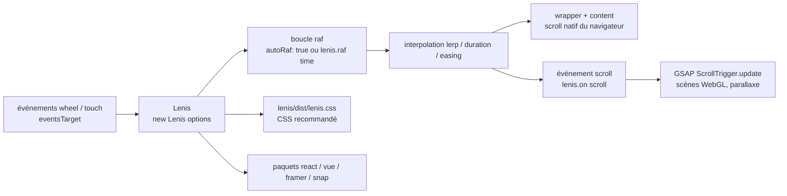

# darkroomengineering/lenis

> **Défilement lissé pour sites web, pour les développeurs front qui synchronisent animations et scroll.**

## Le problème

Le défilement natif du navigateur avance par sauts discrets, ce qui rend saccadées les scènes
WebGL, les parallaxes et les animations déclenchées par le scroll. Les remplacements maison
cassent en général `position: sticky`, les ancres et l'accessibilité, parce qu'ils abandonnent
le scroll du navigateur au lieu de l'envelopper.

## Ce que ça fait vraiment

Lenis enveloppe le défilement natif plutôt que de le remplacer : d'après le README, `position:
sticky`, les liens d'ancre et l'accessibilité continuent de fonctionner. La bibliothèque
interpole la position de scroll image par image, via une boucle `requestAnimationFrame` que
l'on peut laisser à Lenis (`autoRaf: true`) ou piloter soi-même en appelant `lenis.raf(time)`.

Le comportement se règle par options : `lerp` (0.1 par défaut) ou `duration`/`easing` pour le
lissage, `orientation` et `gestureOrientation` pour l'axe (vertical, horizontal, `both`),
`infinite` pour le scroll sans fin, `syncTouch` pour le tactile, `anchors` pour les liens
d'ancre, `allowNestedScroll` ou l'attribut HTML `data-lenis-prevent` pour les conteneurs
imbriqués. `respectReducedMotion` est à `true` par défaut : quand l'utilisateur demande moins
d'animation, le `lerp` est forcé à `1` et les scrolls programmatiques deviennent instantanés.

L'instance expose `scrollTo(target, options)`, `start()`, `stop()`, `resize()`, `destroy()`, des
propriétés lues à chaque image (`scroll`, `velocity`, `progress`, `direction`, `isScrolling`) et
deux événements, `scroll` et `virtual-scroll`. La synchronisation avec GSAP ScrollTrigger est
documentée explicitement. Le dépôt publie aussi des paquets `lenis/react`, `lenis/vue`,
`lenis/framer` et `lenis/snap` (ce dernier pour l'alignement de sections).

## Comment c'est branché



Aucun diagramme tiré du code n'existe pour ce dépôt : ce schéma est reconstruit depuis le seul
README, à partir des noms d'options, de méthodes et de paquets qu'il documente.

## Essayer

```bash
npm i lenis
# or
yarn add lenis
# or
pnpm add lenis
```

Puis, côté code, le montage minimal donné par le README :

```js
import Lenis from 'lenis'
import 'lenis/dist/lenis.css'

// Initialize Lenis
const lenis = new Lenis({
  autoRaf: true,
});

// Listen for the scroll event and log the event data
lenis.on('scroll', (e) => {
  console.log(e);
});
```

Sans build, le README donne une voie par CDN :

```html
<link rel="stylesheet" href="https://unpkg.com/lenis@1.3.26/dist/lenis.css">
<script src="https://unpkg.com/lenis@1.3.26/dist/lenis.min.js"></script> 
<script>new Lenis({ autoRaf: true, autoToggle: true, anchors: true, allowNestedScroll: true, naiveDimensions: true, stopInertiaOnNavigate: true })</script>
```

## Coût et pièges

- **Gratuit, MIT, aucune clé d'API, aucun compte, aucun service tiers** à l'exécution. Pas de
  GPU ni de RAM particulière : c'est quelques kilo-octets de JavaScript, sans dépendance
  d'exécution. Le dépôt sollicite des dons via GitHub Sponsors, sans contrepartie fonctionnelle.
- **Le CSS recommandé n'est pas facultatif** : le README le répète dans le dépannage, et
  `autoToggle` en dépend explicitement.
- **La boucle raf est à votre charge** si `autoRaf` reste à `false` : oublier `lenis.raf(time)`
  donne une page qui ne défile plus. C'est le premier point du dépannage.
- **Plafonds de navigateur** : capé à 60 images/s sur Safari et 30 en mode économie d'énergie ;
  `position: fixed` « semble ramer » sur macOS Safari pré-M1 ; `autoToggle` exige Safari > 17.3,
  Chrome > 116, Firefox > 128.
- **Angles morts** : le scroll lissé ne traverse pas les iframes, qui ne relaient pas les
  événements `wheel` ; `syncTouch` peut se comporter de façon inattendue sur iOS < 16 ;
  `allowNestedScroll` et `naiveDimensions` sont signalés dans le README comme coûteux en
  performance.
- **La version CDN épingle `lenis@1.3.26`** : une dépendance au réseau unpkg au chargement de
  la page, à remplacer par une copie servie chez soi en production.

## Ce que ce n'est pas

- **Ce n'est pas un moteur d'animation.** Lenis produit une position de scroll lissée et des
  événements ; les animations, parallaxes et scènes WebGL restent à écrire avec GSAP, Three.js
  ou autre. Le README ne montre que le branchement.
- **Ce n'est pas compatible avec CSS scroll-snap** : le README l'indique comme limitation, il
  faut passer par le paquet `lenis/snap`.
- **Ce n'est pas neutre pour l'utilisateur** : un scroll lissé modifie une interaction système.
  Le garde-fou existe (`respectReducedMotion` à `true`), mais il est désactivable, et le README
  déconseille lui-même de le faire.

## Alternatives

| | Quand le préférer |
|---|---|
| **locomotivemtl/locomotive-scroll** | Cité par le README dans ses greffons. À regarder si l'on veut un ensemble scroll lissé + effets déjà intégrés plutôt qu'une brique qui se branche. |
| **14islands/r3f-scroll-rig** | Cité par le README dans ses greffons. À préférer quand le besoin est précisément React Three Fiber : le rig de synchronisation WebGL est déjà écrit. |

Les voisins du catalogue (`Asabeneh/30-Days-Of-JavaScript`, `bvaughn/react-virtualized`,
`haizlin/fe-interview`, `lucide-icons/lucide`) ne sont pas comparables : cours, virtualisation
de listes, questions d'entretien et jeu d'icônes n'adressent pas le défilement lissé.

## Pour toi

Passe ton chemin pour le cœur du métier : rien ici ne touche aux données, aux modèles ni au
déploiement. La seule fenêtre d'usage est la vitrine — page de démo, portfolio, site de projet —
et là, la voie CDN en une ligne suffit, sans rien apprendre de plus.
