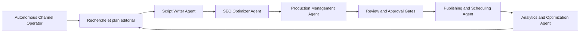

# darkzOGx/youtube-automation-agent

> Agent auto-hébergé qui produit et publie des vidéos YouTube de bout en bout, sous validation humaine.

## Le problème
Tenir une chaîne YouTube enchaîne recherche, script, narration, visuels, montage, métadonnées et analyse.
Chaque étape est un outil différent, et rien ne relie les résultats aux décisions suivantes.

## Ce que ça fait vraiment
Une chaîne d'agents : stratégie, script, miniature, SEO, production, publication, analytique, avec boucle de retour.
Rien n'est programmé tant que les portes qualité, droits et revue humaine ne sont pas passées.
Points de reprise SQLite par étape : une coupure se reprend à la première étape incomplète.
Studios dédiés : réparation de scène, découpe en Shorts, bureau de preuves, expériences de croissance contrôlées.

## Comment c'est branché


## Essayer
```bash
git clone https://github.com/darkzOGx/youtube-automation-agent.git
cd youtube-automation-agent
npm install
npm run walkthrough
npm start
```

## Coût et pièges
Clés de fournisseurs texte, TTS et vidéo à ta charge ; la génération vidéo payante se facture à la seconde.
Identifiants YouTube Data API à créer, et les sondes de vérification payantes sont des cases à cocher séparées.

## Ce que ce n'est pas
Pas neutre : le titre du dépôt porte une adresse de jeton `pump`, ce qui mêle le projet à une opération crypto.
Pas autonome pour autant : les portes de validation humaine sont partout, et c'est présenté comme voulu.
Pas un outil de qualité éditoriale — il produit du volume, la pertinence reste à ta charge.

## Alternatives
DarkzSEO, module optionnel du même auteur pour l'audit de découvrabilité.

## Pour toi
Hors de ton périmètre, et le rattachement crypto suffit à l'écarter ; à ignorer.
