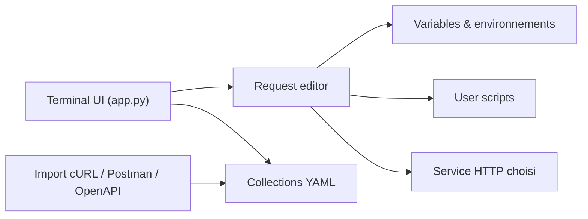

# darrenburns/posting

> Client HTTP en terminal, type Postman, pour développeurs qui aiment le clavier et SSH.

## Le problème
Les clients HTTP graphiques sont lourds, peu utilisables via SSH et stockent leurs requêtes dans des formats difficiles à versionner.

## Ce que ça fait vraiment
Application TUI Textual qui édite, exécute et enregistre des requêtes HTTP dans des fichiers YAML locaux. Gère environnements et variables, auto-complétion, scripts Python avant/après requête, import de cURL, Postman et OpenAPI, export cURL.

## Comment c'est branché


## Essayer
```bash
curl -LsSf https://astral.sh/uv/install.sh | sh
uv tool install --python 3.13 posting
posting
```

## Coût et pièges
Gratuit. Installation via uv (installe Python 3.13 si besoin). Homebrew et NixOS non supportés officiellement.

## Ce que ce n'est pas
Pas un outil de test de charge ni un serveur ; aucun backend n'est fourni. Les scripts Python utilisateur s'exécutent en local.

## Alternatives
Postman et Insomnia sont cités comme comparaison ; le README ne les recommande pas en remplacement.

## Pour toi
Adopter pour tester tes API de modèles depuis un serveur distant en SSH, avec requêtes versionnables en YAML.

