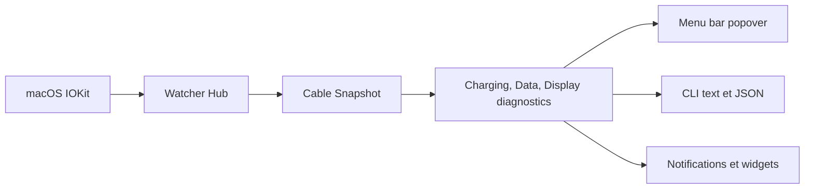

# darrylmorley/whatcable

> Petite app macOS de barre de menus qui dit ce que chaque câble USB-C peut faire.

## Le problème
Des câbles USB-C identiques peuvent aller d'un simple câble de charge USB 2.0 à du Thunderbolt 240 W, et on ignore pourquoi le Mac charge lentement.

## Ce que ça fait vraiment
Lit l'état des ports via IOKit, sans entitlement ni API privée : puces e-marker du câble, profils de puissance du chargeur, appareils connectés, liaison Thunderbolt. Il affiche un verdict en clair (« Cable is limiting charging speed »), des signaux de confiance sur des valeurs inhabituelles et une base de câbles connus. Un CLI `whatcable` (JSON, watch, raw) est fourni. Une offre Pro payante ajoute historique des câbles, moniteur de puissance et tableau de bord terminal.

## Comment c'est branché


## Essayer
```bash
brew install --cask darrylmorley/whatcable/whatcable
brew install darrylmorley/whatcable/whatcable-cli
whatcable --json
whatcable --watch
```

## Coût et pièges
Gratuit ; Pro payant à l'achat unique, sur deux Macs au plus. Apple Silicon et macOS 14 minimum, faute de données PD sur Mac Intel. Rien n'est envoyé automatiquement ; seuls une vérification de mise à jour toutes les six heures et l'envoi de diagnostics sur clic existent.

## Ce que ce n'est pas
Un logiciel ne peut pas vérifier le câblage réel : si la puce e-marker ment, WhatCable ne le détecte pas. Le cœur du diagnostic n'est pas destiné aux ports sans contrôleur (façade des Mac mini/Studio).

## Alternatives
Le README nomme WhatBattery (santé de batterie) et WhatPort (tous les ports), du même auteur, comme compléments ; usbeehive pour Linux.

## Pour toi
Ignorer : diagnostic matériel macOS sans lien avec la donnée ou l'IA ; dépôt jeune (mai 2026) à licence non identifiée.

