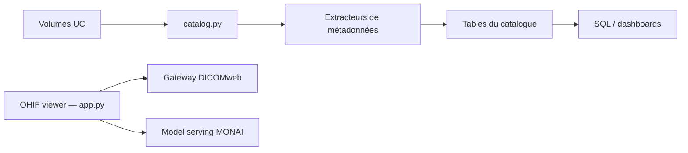

# databricks-industry-solutions/pixels

> Accélérateur Databricks pour cataloguer des images DICOM, les analyser en SQL et les segmenter avec MONAI.

## Le problème
Des millions de fichiers DICOM sont difficiles à indexer, protéger (données de santé) et exploiter en SQL ou en IA.

## Ce que ça fait vraiment
La bibliothèque `dbx.pixels` indexe des fichiers DICOM (batch ou streaming Auto Loader), extrait les métadonnées vers des tables Unity Catalog, peut anonymiser les tags par chiffrement préservant le format. Des apps Databricks fournissent un viewer OHIF, un serveur DICOMweb (QIDO/WADO/STOW) et une segmentation MONAI/Vista3D sur GPU serverless, avec superpositions NIfTI. Installation par Databricks Asset Bundles.

## Comment c'est branché


## Essayer
```python
from dbx.pixels import Catalog
from dbx.pixels.dicom import *
catalog = Catalog(spark)
catalog_df = catalog.catalog(<path>)
meta_df = DicomMetaExtractor(catalog).transform(catalog_df)
catalog.save(meta_df)
```

## Coût et pièges
Workspace Databricks obligatoire (Unity Catalog, Lakebase, SQL warehouse, GPU pour le serving). Installation complète : 30 à 45 minutes selon le README. Redaction des pixels encore en cours d'intégration.

## Ce que ce n'est pas
Pas un outil autonome ni open source pur : licence Databricks renvoyant à leur propre texte, non identifiée par GitHub. Pas de production du format NIfTI (sur la feuille de route).

## Alternatives
Aucune alternative nommée dans le README.

## Pour toi
À surveiller : référence solide si tu travailles sur de l'imagerie médicale sur Databricks, à écarter hors de cet écosystème, et la licence est à lire avant tout usage.

