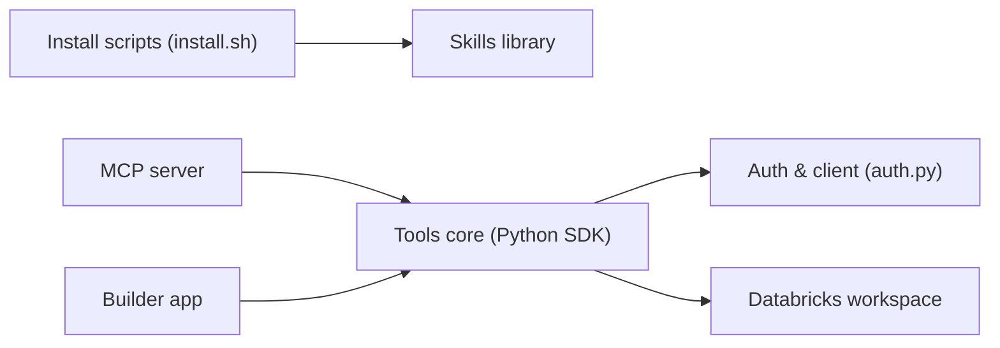

# databricks-solutions/ai-dev-kit

> Kit d'installation et d'outils pour utiliser des agents de code sur Databricks, pour ingénieurs data.

## Le problème
Les agents de code connaissent mal les patterns Databricks (pipelines, Unity Catalog, jobs, MLflow).

## Ce que ça fait vraiment
Le README annonce que les skills sont désormais fournies par les « Databricks AI Tools » officiels (`databricks aitools install`) ; les copies dans ce dépôt sont dépréciées. Restent : l'installeur, un serveur MCP (40+ outils, maintenu au mieux), `databricks-tools-core` (bibliothèque Python : SQL, jobs, catalogue…) et une Builder App (FastAPI + React) déployable sur Databricks Apps. Un harnais `.test/` évalue les skills.

## Comment c'est branché


## Essayer
```bash
bash <(curl -sL https://raw.githubusercontent.com/databricks-solutions/ai-dev-kit/main/install.sh)
databricks aitools install
cd ai-dev-kit/databricks-builder-app
./scripts/start_local.sh --profile <your-profile>
```

## Coût et pièges
Workspace Databricks et CLI v1.0.0+ requis ; la Builder App provisionne Lakebase. Le README est tronqué au tableau final (composants coupés).

## Ce que ce n'est pas
Ce n'est plus la source des skills : elles vivent ailleurs. Le MCP n'est maintenu qu'au mieux ; le dépôt sert surtout de porte d'entrée.

## Alternatives
- databricks/databricks-agent-skills : source officielle des skills.
- mlflow/skills : skills MLflow.
- databricks-solutions/apx : framework FastAPI + React pour Apps.

## Pour toi
À surveiller : utile si tu travailles sur Databricks, mais mieux vaut passer directement par `databricks aitools` que par ce kit en transition.
