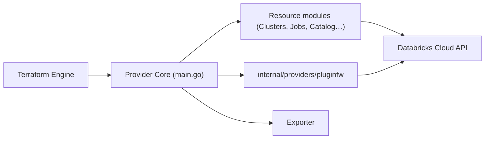

# databricks/terraform-provider-databricks

> Provider Terraform officiel pour créer et gérer des ressources Databricks en infrastructure as code.

## Le problème
Configurer clusters, jobs, notebooks et catalogues Databricks à la main dans l'interface ne se versionne pas ni ne se reproduit.

## Ce que ça fait vraiment
Un plugin Go traduit du HCL en appels à l'API Databricks. Modules par domaine : catalog, clusters, access, dashboards, jobs, mlflow, mws, pipelines, apps. Une couche « plugin framework » convertit schémas et modèles d'API, avec génération de code. Un exportateur expérimental produit du Terraform depuis un espace existant.

## Comment c'est branché


## Essayer
```bash
terraform init
terraform apply
```
Avec un `main.tf` déclarant `source = "databricks/databricks"`, l'hôte de l'espace et un jeton PAT.

## Coût et pièges
Terraform 1.1.5+ ; un espace de travail Databricks payant et un jeton. Migration depuis `databrickslabs/databricks` à faire dans les `.tf`. 683 issues ouvertes. Licence non reconnue par GitHub : à vérifier.

## Ce que ce n'est pas
Pas un client Python ni un outil de gestion de données : il ne fait que déclarer l'infrastructure. L'exportateur est expérimental.

## Alternatives
Aucune alternative citée dans le README.

## Pour toi
À adopter si tu opères Databricks : c'est le chemin officiel pour versionner l'infrastructure MLOps, à condition de vérifier la licence.
