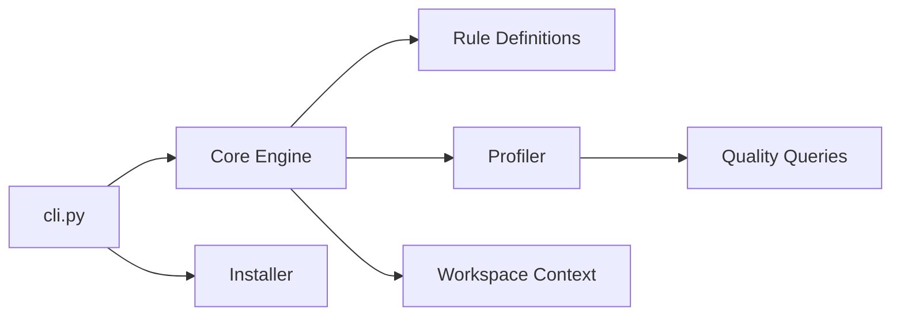

# databrickslabs/dqx

> Bibliothèque de contrôle qualité des données pour DataFrames PySpark, batch et streaming, sur Databricks.

## Le problème
Des données invalides passent dans les pipelines Spark sans règle explicite ni traçabilité des échecs.

## Ce que ça fait vraiment
Plus de 80 vérifications intégrées (nulls, plages, regex, références, agrégats, géo, PII), définies en code ou en YAML/JSON, avec niveau avertissement ou erreur, et réaction (rejeter, marquer, mettre en quarantaine). Elle ajoute profilage avec génération de règles, règles assistées par LLM (DSPy), détection d'anomalies par Isolation Forest, contrats de données ODCS, métriques dans Delta avec tableau de bord Lakeview, alertes Slack/Teams, DQX Studio et un serveur MCP.

## Comment c'est branché


## Essayer
```bash
# Aucune commande d'installation dans le README : voir https://databrickslabs.github.io/dqx/
```

## Coût et pièges
La bibliothèque est gratuite, mais Databricks (ou Spark) est requis ; Model Serving pour les fonctions LLM, et des ressources Databricks facturées pour tableau de bord et Studio. La licence n'est pas reconnue par GitHub. Projet Labs : support communautaire.

## Ce que ce n'est pas
Pas un outil hors Spark : conçu pour PySpark. Le README ne donne pas de commande d'installation ni d'exemple de code.

## Alternatives
Aucune alternative nommée dans le README.

## Pour toi
Adopter si tu fais de la donnée sur Spark/Databricks : contrôle qualité déclaratif et streaming, mais vérifie la licence avant un usage sensible.
