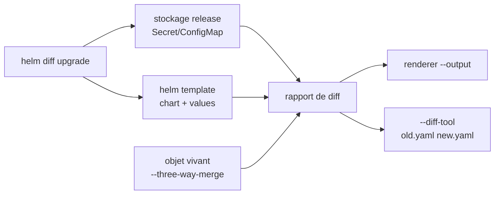

# databus23/helm-diff

> Plugin Helm qui montre le diff d'un `helm upgrade` avant de l'appliquer, pour opérateurs Kubernetes.

## Le problème
`helm upgrade` s'exécute à l'aveugle : on découvre après coup qu'un champ a sauté.
Comparer deux révisions d'une release demandait de rendre les manifestes à la main.

## Ce que ça fait vraiment
Récupère le manifeste de la release déployée et le compare au rendu de `helm template`.
Sous-commandes : `upgrade`, `release`, `revision`, `rollback`, `local` (deux dossiers de charts).
Sorties `diff`, `simple`, `template`, `json`, `structured` (JSON par JSON Pointer), `dyff`.
`--three-way-merge` compare au vivant du cluster, mode `server` (dry-run API) ou `client` (fusion locale).

## Comment c'est branché


## Essayer
```bash
helm plugin install https://github.com/databus23/helm-diff
helm diff upgrade prod api ./charts/api --output structured
helm diff local ./chart-v1 ./chart-v2 -f values.yaml
helm diff upgrade api ./charts/api --diff-tool "difft --language yaml"
```

## Coût et pièges
Gratuit, aucun compte. Le mode `client` du three-way-merge a quatre déviations documentées, dont une
où une dérive cachée dans une liste atomique n'est pas rapportée. Le RBAC doit couvrir chaque kind rendu.

## Ce que ce n'est pas
Ce n'est pas un outil de politique ni de validation : il montre, il ne bloque pas
(sauf `--detailed-exitcode`). Ce n'est pas un remplacement de `kubectl diff` sur un cluster entier.
Pas de timeout autour d'un `--diff-tool` : un outil qui ne rend pas la main bloque le diff.

## Alternatives
Aucune nommée dans le README ; seuls des outils de diff externes (difft, delta, dyff) sont cités.

## Pour toi
À installer d'office si tu déployes des charts Helm en CI : le `--output structured` s'intègre bien.
