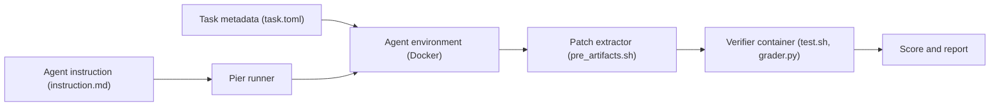

# datacurve-ai/deep-swe

> Benchmark de 113 tâches de génie logiciel longues, pour évaluer des agents de code.

## Le problème
Les benchmarks de codage courts saturent ; il faut des tâches longues sur de vrais dépôts actifs.

## Ce que ça fait vraiment
Collection de tâches au format Harbor (TypeScript, Go, Python, JavaScript, Rust) : `task.toml`, `instruction.md`, Dockerfile d'environnement, tests retenus et solution de référence. L'agent travaille dans un conteneur isolé et commite ; `pre_artifacts.sh` en tire un patch appliqué dans un conteneur vérificateur neuf, avec scores structurés. Exécuté par le runner externe Pier.

## Comment c'est branché


## Essayer
```bash
git clone https://github.com/datacurve-ai/deep-swe
uv tool install datacurve-pier
export ANTHROPIC_API_KEY=...
pier run -p deep-swe/tasks --agent mini-swe-agent --model anthropic/claude-opus-4-8
pier run -p deep-swe/tasks --agent mini-swe-agent --n-tasks 10 --sample-seed 0
```

## Coût et pièges
Clés LLM à ta charge ; Docker et Pier ; Modal en option pour paralléliser. Le coût d'un passage complet n'est pas indiqué.

## Ce que ce n'est pas
Pas une application : aucun service, seulement un corpus. Les scores du classement viennent de l'éditeur (Pier et mini-swe-agent sur Modal).

## Alternatives
Aucune alternative nommée dans le README.

## Pour toi
À surveiller : utile pour comparer des agents de code, mais lancer les 113 tâches coûte cher, donc mesure d'abord sur un sous-ensemble.
