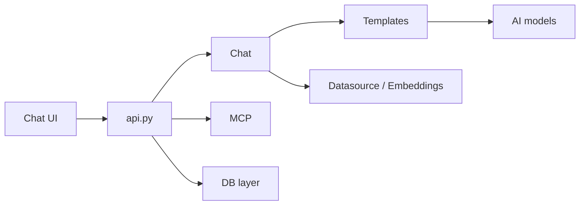

# dataease/SQLBot

> Système text-to-SQL auto-hébergé (ChatBI) avec RAG, pour interroger ses bases en langage naturel.

## Le problème
Les métiers dépendent des analystes pour chaque requête SQL ; un LLM seul génère du SQL faux sans contexte métier.

## Ce que ça fait vraiment
Backend FastAPI : sources de données, permissions ligne/colonne par espace de travail, embeddings de tables pour le RAG.
Génération SQL, graphiques et analyses via des gabarits de prompts ; glossaire métier et exemples SQL pour calibrer.
Front Vue avec chat, tableaux de bord, mode embarqué ; module MCP pour être appelé par d'autres agents.
Fournisseurs LLM compatibles OpenAI (DeepSeek, Qwen, Kimi, Gemini…).

## Comment c'est branché


## Essayer
```bash
docker run -d --name sqlbot --restart unless-stopped -p 8000:8000 -p 8001:8001 -v ./data/sqlbot/excel:/opt/sqlbot/data/excel -v ./data/sqlbot/file:/opt/sqlbot/data/file -v ./data/sqlbot/images:/opt/sqlbot/images -v ./data/sqlbot/logs:/opt/sqlbot/app/logs -v ./data/postgresql:/var/lib/postgresql/data --privileged=true dataease/sqlbot
```

## Coût et pièges
Clé API LLM à ta charge ; conteneur lancé en `--privileged`, mot de passe admin par défaut à changer.
Licence non identifiée par GitHub : à lire avant usage commercial.

## Ce que ce n'est pas
Pas une bibliothèque text-to-SQL intégrable en Python.
Pas garanti exact : la qualité dépend du glossaire et des exemples fournis.

## Alternatives
- DataEase : BI open source du même éditeur, sans conversation.
- MaxKB : plateforme d'agents du même éditeur.

## Pour toi
À surveiller : cas d'usage ChatBI très pertinent pour la data, à évaluer sérieusement une fois la licence clarifiée.
