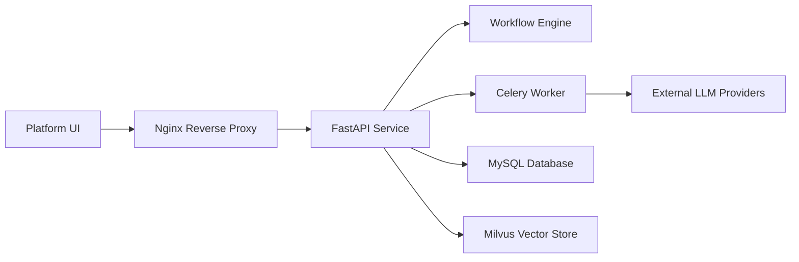

# dataelement/bisheng

> Plateforme auto-hébergée d'applications LLM pour l'entreprise : workflows visuels, agents, RAG, parsing documentaire.

## Le problème
Déployer en entreprise des applications LLM (revue documentaire, rapports, service client) demande orchestration, RBAC et parsing fiable.

## Ce que ça fait vraiment
Éditeur de workflows avec boucles, parallélisme, traitement par lots, conditions et intervention humaine en cours d'exécution.
Agent « Lingsight » guidé par un langage AGL encodant l'expertise métier.
Fonctions entreprise : RBAC, groupes, SSO/LDAP, quotas, supervision.
Backend FastAPI + Celery, frontends React, MySQL, Redis, Elasticsearch, Milvus, OnlyOffice ; modèle OCR/tables privé déployable.

## Comment c'est branché


## Essayer
```bash
git clone https://github.com/dataelement/bisheng.git
cd bisheng/docker
docker compose -f docker-compose.yml -p bisheng up -d
```

## Coût et pièges
Minimum 4 vCPU et 16 Go de RAM, 18 vCPU/48 Go recommandés ; ES, Milvus et OnlyOffice installés d'office.
Modèles LLM externes à ta charge.

## Ce que ce n'est pas
Pas un framework léger : c'est une pile complète à opérer.
Documentation et écosystème largement orientés marché chinois.

## Alternatives
Aucune alternative nommée dans le README.

## Pour toi
À surveiller si tu dois fournir une plateforme LLM interne avec workflows et RBAC : lourd à héberger, mais couvre ce que les frameworks laissent de côté.
