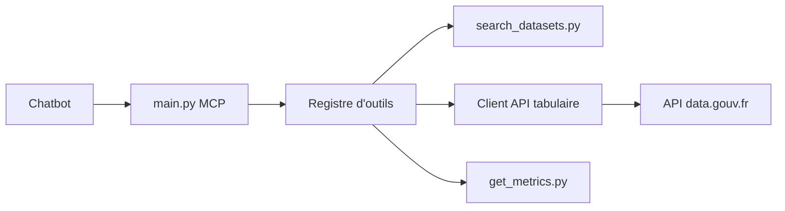

# datagouv/datagouv-mcp

> Serveur MCP qui permet à un assistant d'interroger en conversation les jeux de données de data.gouv.fr.

## Le problème
Trouver et lire les données ouvertes françaises demande de parcourir le site et de télécharger des fichiers à la main.

## Ce que ça fait vraiment
Serveur MCP Python en HTTP exposant des outils en lecture seule : recherche de jeux de données et d'organisations, détails des jeux et ressources, interrogation de ressources tabulaires (CSV jusqu'à 100 Mo, XLSX 12,5 Mo), métriques de visites et téléchargements, recherche d'API tierces et résumé de leur spécification OpenAPI. Une instance publique est ouverte, sans clé. Le code inclut des garde-fous contre les requêtes SSRF et un endpoint de santé.

## Comment c'est branché


## Essayer
```bash
claude mcp add --transport http datagouv https://mcp.data.gouv.fr/mcp
git clone git@github.com:datagouv/datagouv-mcp.git
cd datagouv-mcp
docker compose up -d
uv run main.py
```

## Coût et pièges
Gratuit, sans clé d'API. L'instance publique dépend d'un service tiers et du réseau. Le code comprend une analytique d'usage (Matomo) et un suivi d'erreurs Sentry optionnel (désactivé sans `SENTRY_DSN`). L'outil de métriques ne fonctionne qu'en production.

## Ce que ce n'est pas
Pas une base de données locale : chaque question interroge l'API en direct. Les requêtes tabulaires sont limitées par pagination et par taille de fichier ; au-delà, il faut récupérer le fichier.

## Alternatives
Aucune alternative nommée dans le README.

## Pour toi
Adopter : connexion immédiate et gratuite à la donnée ouverte française pour un assistant, utile pour explorer des jeux de données avant un projet data ; vérifier la télémétrie si tu auto-héberges.

