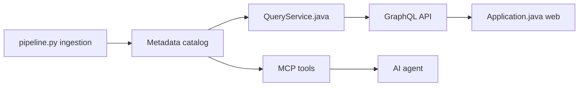

# datahub-project/datahub

> Catalogue de métadonnées open source pour découvrir, gouverner et observer les données, y compris via des agents IA.

## Le problème
Dans une pile de données fragmentée, retrouver la bonne table, son lignage et son propriétaire est laborieux.

## Ce que ça fait vraiment
Ingère des métadonnées (80+ connecteurs : Snowflake, BigQuery, dbt, Airflow…) en batch ou en streaming via Kafka, puis les expose par recherche, lignage, gouvernance, API GraphQL/OpenAPI et interface web. Un serveur MCP (`@acryldata/mcp-server-datahub`) connecte Cursor, Claude Desktop ou Cline ; un agent d'analytique open source est proposé dans un dépôt séparé.

## Comment c'est branché


## Essayer
```bash
pip install acryl-datahub
datahub docker quickstart
# Accès : http://localhost:9002 (identifiants par défaut datahub / datahub)
```

## Coût et pièges
Docker Desktop avec 8 Go de RAM ou plus. Pile complète (GMS, Elasticsearch, MySQL, Kafka). Une offre gérée DataHub Cloud existe. Identifiants par défaut à changer.

## Ce que ce n'est pas
Ce n'est pas le site datahub.io (service distinct d'hébergement de jeux de données).

## Alternatives
Non documenté : le README ne nomme pas d'alternative.

## Pour toi
Adopter si ton organisation a plusieurs sources de données et besoin de lignage : Apache-2.0, activité récente ; compte la pile lourde.

