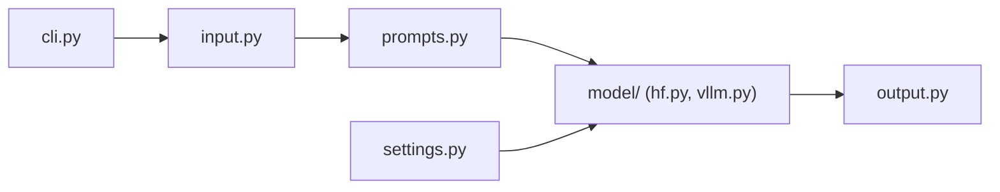

# datalab-to/chandra

> Modèle OCR qui convertit images et PDF en Markdown, HTML ou JSON avec la mise en page.

## Le problème
Extraire des documents (tableaux, formules, écriture manuscrite, formulaires) sans perdre la structure est difficile.

## Ce que ça fait vraiment
Le paquet normalise les pages, construit des prompts, appelle un backend (HuggingFace local ou serveur vLLM) et écrit `.md`, `.html`, `_metadata.json` et les images extraites. Le README annonce 90+ langues ; les scores viennent de benchmarks maison et olmocr.

## Comment c'est branché


## Essayer
```bash
pip install chandra-ocr
chandra_vllm
chandra input.pdf ./output
pip install chandra-ocr[hf]
chandra input.pdf ./output --method hf
```

## Coût et pièges
Le code est Apache-2.0, mais les poids suivent une licence OpenRAIL-M modifiée : gratuits en recherche, usage personnel et startups sous 2 M$, pas d'usage concurrent de leur API. `chandra_vllm` lance un conteneur Docker et demande un GPU.

## Ce que ce n'est pas
Pas totalement libre pour un usage commercial : le README renvoie à une licence payante. La version hébergée est présentée comme plus précise que les poids ouverts.

## Alternatives
olmocr, dots.ocr et Deepseek OCR figurent au tableau comparatif ; le README ne les recommande pas explicitement.

## Pour toi
Surveiller : très utile pour l'extraction documentaire, mais vérifie la licence des poids avant tout usage en entreprise.

