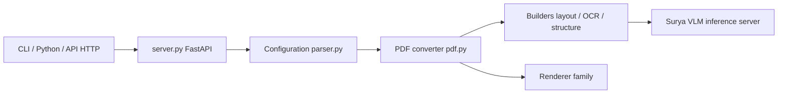

# datalab-to/marker

> Convertit PDF, images, Office, HTML et EPUB en Markdown, JSON, HTML ou chunks, pour pipelines de documents.

## Le problème
Extraire proprement texte, tableaux, formules et images d'un PDF pour un pipeline RAG ou d'analyse est fragile.

## Ce que ça fait vraiment
Même projet que VikParuchuri/marker (README identique). Il lit le texte du PDF, détecte la mise en page et fait passer par un VLM surya local les pages scannées ou abîmées, les équations et les tableaux peu sûrs. Modes `balanced` (GPU) et `fast` (CPU). D'après l'architecture : API FastAPI (`server.py`), converters, providers, builders (layout, OCR, structure), processors, renderers, LLM optionnel via OpenRouter.

## Comment c'est branché


## Essayer
```bash
pip install marker-pdf
marker_single /path/to/file.pdf
marker /path/to/input/folder --skip_existing
marker_gui
marker_server --port 8001
```

## Coût et pièges
Code sous Apache 2.0 ; poids du modèle sous licence Open Rail-M modifiée (gratuite pour recherche, usage personnel et startups sous 5 M$). `--use_llm` envoie les documents à un fournisseur tiers avec une clé à ta charge. Le mode `balanced` demande Docker et un GPU NVIDIA ; `fast` tourne sur CPU.

## Ce que ce n'est pas
Pas un OCR pleine page de pointe (pour cela : Chandra, surya). Les formulaires et les tableaux imbriqués très complexes restent une limite. L'API intégrée est « pas très robuste ».

## Alternatives
- MinerU : comparé dans le README, plus lent.
- docling : comparé, score plus bas.
- Chandra : modèle hébergé, plus précis.

## Pour toi
Adopter pour préparer des corpus PDF avant indexation ; à traiter comme un doublon de VikParuchuri/marker, à ne compter qu'une fois.

