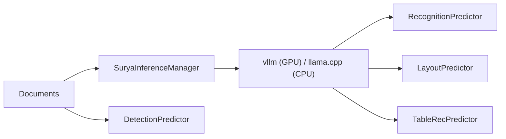

# datalab-to/surya

> Modèle OCR de 650 M de paramètres avec mise en page et tableaux, pour extraire du texte de documents multilingues.

Note : README identique à `VikParuchuri/surya` (même création, mêmes issues) ; les deux entrées désignent vraisemblablement le même projet.

## Le problème
Transformer des documents (PDF, scans, formulaires, notes manuscrites) en texte structuré avec ordre de lecture et tableaux.

## Ce que ça fait vraiment
Un seul modèle vision-langage (architecture de type Qwen3.5, environ 650 M de paramètres) produit la mise en page en JSON ou la page en HTML, selon le prompt. Il est servi par `vllm` ou `llama.cpp`, lancé par `SuryaInferenceManager`. Les mathématiques sortent en LaTeX compatible KaTeX. La détection de lignes est un modèle EfficientViT séparé. Les scores (83,3 % olmOCR-bench, 87,2 % sur 91 langues) sont ceux de l'éditeur.

## Comment c'est branché


## Essayer
```bash
pip install surya-ocr
surya_ocr DATA_PATH --keep_server
surya_layout DATA_PATH
surya_table DATA_PATH
pip install streamlit pdftext
surya_gui
```

## Coût et pièges
Code Apache 2.0, poids sous licence Open Rail-M modifiée (gratuit pour recherche, perso, startups sous 5 M$ de financement ou revenu). Le serveur se relance à chaque commande sauf avec `--keep_server`. Une plateforme payante de l'éditeur est proposée en parallèle (5 $ de crédits offerts).

## Ce que ce n'est pas
Pas un OCR de photos. Le passage de v1 à v2 change les schémas de sortie (`text_lines` devient `blocks`).

## Alternatives
Chandra OCR 2, dots.mocr, LightOnOCR 2-1B, olmOCR (tous dans le tableau du README).

## Pour toi
Adopter pour l'ingestion de documents dans un pipeline RAG ou d'extraction : bon rapport taille/score annoncé, sous réserve de la licence des poids.

