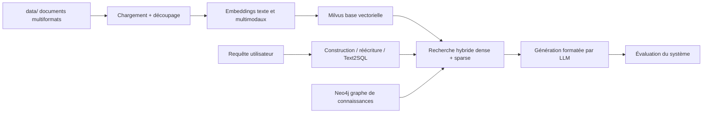

# datawhalechina/all-in-rag

> **A ten-chapter RAG course, from document loading to knowledge-graph retrieval.**

## The problem

RAG is currently learned in fragments: one post on chunking, another on Milvus, a third on
evaluation, with no through-line and no project that actually stands up end to end.

## What it actually does

- A written tutorial in five parts and ten chapters, readable online at
  `datawhalechina.github.io/all-in-rag/`, with an English README (`README_en.md`).
- Covers the full ingestion chain: multi-format data loading, text chunking, text and
  multimodal embeddings, vector databases, index optimisation.
- Covers retrieval: hybrid dense + sparse search, query construction, Text2SQL, query
  rewriting and routing, advanced retrieval techniques.
- Covers generation and evaluation: formatted/structured output, RAG evaluation
  methodology, common tools and metrics.
- Ships two walkthrough projects: the chapter 8 application, then its chapter 9 rewrite as
  Graph RAG (graph data modelling, Milvus index construction, intelligent query routing).
- The repository holds `docs/`, `code/`, `data/`, `models/` and `Extra-chapter/`: teaching
  material and runnable samples, not a library you import.

## How it is wired

The repo describes a RAG chain the reader rebuilds by hand; the components named explicitly
are Milvus for vector storage and Neo4j for the graph chapter.



## Trying it

The README documents no installation or run command at all: it only points to the online
reading site and to the chapters under `docs/`. Chapter 1 contains a "preparation" page and
a Python virtual-environment appendix, but their content is not reproduced in the README.

```bash
# Aucune commande documentée dans le README.
# Point d'entrée annoncé : https://datawhalechina.github.io/all-in-rag/
# puis les chapitres sous docs/chapter1/ ... docs/chapter10/
```

## Cost and gotchas

Free to read. Stated prerequisites: basic Python, some familiarity with Docker, basic LLM
concepts (recommended, not required), and basic Linux command line. The badge pins Python
3.12.7. The real cost shows up in the exercises: running Milvus (so Docker and RAM), an
embedding model, a generation LLM — the README says nothing about which provider, whether a
paid API key is needed, or how much VRAM the `models/` directory expects. The body of the
tutorial is in Chinese; only the README has an English version.

## What it is not

Not a RAG framework: nothing to `pip install`, no public API, just documents and sample code
to copy. Not a deployable product either — the chapter 8 and 9 applications are teaching
vehicles. And the CC BY-NC-SA 4.0 licence declared at the foot of the README forbids
commercial use and requires share-alike, so reusing these chapters in paid internal training
is not covered.

## Alternatives

No comparable alternative in the catalogue. The suggested neighbours are software components
rather than tutorials: milvus-io/milvus is precisely the vector database used in chapters 3
and 9 (a complement, not a substitute), neuml/txtai and RyanCodrai/turbovec are embedding and
vector-search libraries, and xerrors/Yuxi is a separate application. A course is not replaced
by a dependency.

## For you

Read it, do not adopt it: a useful map of the RAG territory for scoping a project or planning
a team ramp-up, provided you read Chinese. If you already run RAG pipelines in production the
value narrows to the evaluation and Graph RAG chapters; and the non-commercial clause rules
out reusing it as client-facing material.
