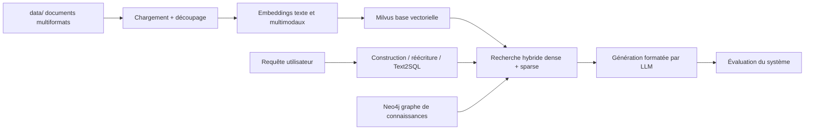

# datawhalechina/all-in-rag

> **Un cours RAG en dix chapitres, du chargement de documents au graphe de connaissances.**

## Le problème

Apprendre le RAG se fait aujourd'hui par bribes : un billet sur le chunking, un autre sur
Milvus, un troisième sur l'évaluation, sans fil conducteur ni projet qui tienne debout.

## Ce que ça fait vraiment

- Un tutoriel écrit, organisé en cinq parties et dix chapitres, lisible en ligne sur
  `datawhalechina.github.io/all-in-rag/`, doublé d'une version anglaise (`README_en.md`).
- Couvre la chaîne complète : chargement de données, découpage en chunks, embeddings texte
  et multimodaux, base vectorielle, optimisation d'index.
- Traite la partie recherche : recherche hybride dense + sparse, construction de requête,
  Text2SQL, réécriture et distribution de requêtes, techniques avancées.
- Traite génération et évaluation : sortie formatée, méthodologie d'évaluation d'un système
  RAG, outils et métriques courants.
- Fournit deux projets fil rouge : le projet du chapitre 8, puis sa réécriture en Graph RAG
  au chapitre 9 (modélisation du graphe, index Milvus, routage de requêtes).
- Le dépôt contient les répertoires `docs/`, `code/`, `data/`, `models/` et `Extra-chapter/` :
  la matière pédagogique et les exemples, pas une bibliothèque à importer.

## Comment c'est branché

Le dépôt décrit une chaîne RAG que le lecteur reconstruit lui-même ; les composants cités
nommément sont Milvus pour le vectoriel et Neo4j pour le volet graphe.



## Essayer

Le README ne donne aucune commande d'installation ni d'exécution : il renvoie uniquement
vers la lecture en ligne et vers les chapitres du dossier `docs/`. Le chapitre 1 comporte
une page « 准备工作 » (préparation d'environnement) et une annexe sur les environnements
virtuels Python, mais leur contenu n'est pas reproduit dans le README.

```bash
# Aucune commande documentée dans le README.
# Point d'entrée annoncé : https://datawhalechina.github.io/all-in-rag/
# puis les chapitres sous docs/chapter1/ ... docs/chapter10/
```

## Coût et pièges

Rien à payer pour lire. Les prérequis annoncés par le README : bases de Python, savoir se
servir un peu de Docker, notions de LLM (recommandées, pas obligatoires), et un minimum de
ligne de commande Linux. Le badge annonce Python 3.12.7. Le coût réel arrive avec les
exercices : faire tourner Milvus (donc Docker et de la RAM), un modèle d'embedding, un LLM
de génération — le README ne dit ni quel fournisseur, ni s'il faut une clé d'API payante,
ni combien de VRAM pour les modèles du dossier `models/`. Le corps du tutoriel est en
chinois ; seule une version anglaise du README est signalée.

## Ce que ce n'est pas

Ce n'est pas un framework RAG : rien à `pip install`, aucune API publique, le dépôt ne
fournit que des documents et des exemples de code à recopier. Ce n'est pas non plus un
projet déployable en l'état — les deux applications des chapitres 8 et 9 sont des supports
pédagogiques. Enfin, la licence CC BY-NC-SA 4.0 annoncée en pied de README interdit l'usage
commercial et impose le partage à l'identique : reprendre ces chapitres dans une formation
interne facturée n'est pas couvert.

## Alternatives

Aucune alternative comparable dans le catalogue. Les voisins proposés sont des briques
logicielles et non des tutoriels : milvus-io/milvus est justement la base vectorielle
utilisée par les chapitres 3 et 9 (complément, pas substitut), neuml/txtai et
RyanCodrai/turbovec sont des bibliothèques d'embedding et de recherche vectorielle,
xerrors/Yuxi est une application distincte. On ne remplace pas un cours par une dépendance.

## Pour toi

À lire, pas à adopter : c'est une carte du territoire RAG utile pour cadrer un projet ou
préparer une montée en compétence d'équipe, à condition de lire le chinois. Si tu construis
déjà des pipelines RAG en production, la valeur se limite aux chapitres évaluation et Graph
RAG ; et la clause non commerciale rend sa réutilisation en support client impossible.
