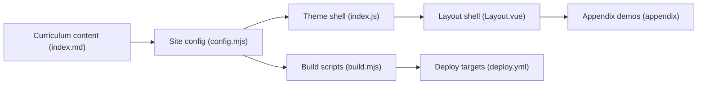

# datawhalechina/easy-vibe

> Cursus en ligne multilingue pour apprendre à coder avec l'IA, du débutant aux agents.

## Le problème
Les débutants et profils produit veulent construire avec les outils de « vibe coding » sans savoir par où commencer, et oublient ce qu'ils apprennent faute de parcours.

## Ce que ça fait vraiment
Site VitePress statique en 10 langues, organisé en étapes : prise en main, prototypes, full-stack, puis Claude Code, MCP, Skills, agents.
Composants Vue interactifs : démos animées, parcours RAG cliquable, visualisations du terminal.
Annexe de plus de 80 sujets sur fondamentaux informatiques, frontend/backend, infra, IA.
Projets guidés : SaaS de rédaction IA, système d'examens en ligne, apps mobiles et desktop.

## Comment c'est branché


## Essayer
```bash
npm install
npm run dev
```

## Coût et pièges
Gratuit. Les cours renvoient à des outils (Claude Code, Stripe, Supabase) qui ont leurs propres coûts.

## Ce que ce n'est pas
Pas une bibliothèque ni un outil. Contenu surtout pensé pour débutants ; le chinois est la version la plus complète. Aucune licence déclarée pour le contenu.

## Alternatives
Aucune alternative nommée ; le README renvoie à deux autres cours de l'équipe.

## Pour toi
À ignorer : cursus de débutant ; seules les sections avancées sur Claude Code et le RAG pourraient servir de support pour former des collègues.
