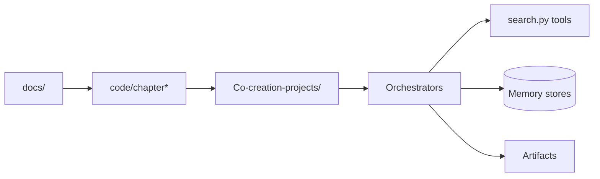

# datawhalechina/hello-agents

> Cours en chinois, en 16 chapitres, pour construire des agents LLM, de la théorie aux projets.

## Le problème
Les tutoriels sur les agents sont éparpillés et souvent centrés sur un seul framework, sans progression ni pratique suivie.

## Ce que ça fait vraiment
Un livre en ligne (`docs/`, PDF en release) en cinq parties : bases (définitions, histoire, LLM), paradigmes à la main (ReAct, Plan-and-Solve, Reflection), plateformes low-code, frameworks (AutoGen, AgentScope, LangGraph), écriture de son propre framework, puis mémoire/RAG, contexte, protocoles (MCP, A2A, ANP), Agentic RL (SFT → GRPO), évaluation.
`code/chapter*` fournit des démos par chapitre ; `Co-creation-projects/` rassemble des applis complètes de contributeurs (recherche, voyage, écriture) sur un même schéma : UI/API → agents → outils → mémoire → artefacts.

## Comment c'est branché

## Essayer
Aucune commande documentée dans le README : lecture en ligne ou PDF, code dans `code/`.

## Coût et pièges
Contenu gratuit ; les exemples appellent des LLM et des API de recherche via `.env`, donc des clés à ta charge. Le texte est en chinois.

## Ce que ce n'est pas
Pas un framework à mettre en production : le framework HelloAgents sert à apprendre. Les projets communautaires sont de qualité variable, chacun avec sa propre architecture.

## Alternatives
- Dify, Coze, n8n — plateformes low-code couvertes au chapitre 5, si tu veux assembler sans coder.
- AutoGen, AgentScope, LangGraph — frameworks traités au chapitre 6, pour construire directement.

## Pour toi
À surveiller : les chapitres Agentic RL et évaluation valent le détour, si le chinois ne te bloque pas.
