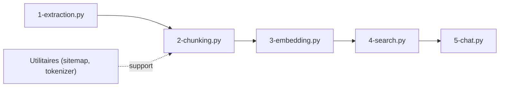

# daveebbelaar/ai-cookbook

> Recueil d'exemples de code à copier pour bâtir des systèmes IA, par un ingénieur IA indépendant.

## Le problème
Trouver des exemples concrets de pipelines RAG et de patrons de workflows LLM à réutiliser.

## Ce que ça fait vraiment
Le README est très court (présentation de l'auteur). D'après le code : un pipeline de connaissance en cinq scripts (extraction, chunking, embedding, recherche, chat, avec Docling) et un dossier de patrons de workflows (enchaînement de prompts, routage, parallélisation, orchestrateur). Le README ne détaille ni prérequis ni exécution.

## Comment c'est branché


## Essayer
```bash
# Aucune commande documentée dans le README.
# Le dépôt fournit un fichier .env.example pour les clés.
```

## Coût et pièges
Clés d'API de fournisseurs LLM probablement à ta charge (non documenté). Le README fait aussi la promotion de cours et de services de l'auteur.

## Ce que ce n'est pas
Pas une bibliothèque ni un package : des scripts pédagogiques indépendants.

## Alternatives
Aucune alternative nommée dans le README.

## Pour toi
À surveiller : sert de source d'idées pour un pipeline Docling→RAG et des patrons de workflows, mais sans documentation d'exécution tu devras lire les scripts toi-même.
