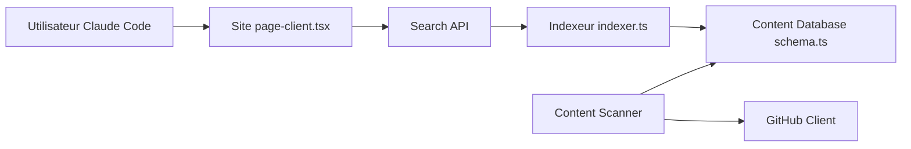

# davepoon/buildwithclaude

> Place de marché et index de plugins, agents, commandes et hooks pour Claude Code.

## Le problème
Les extensions de Claude Code sont dispersées ; trouver et installer celles qui conviennent prend du temps.

## Ce que ça fait vraiment
Le dépôt sert de marketplace de plugins : 117 agents, 175 commandes, 28 hooks, 26 skills et 51 plugins groupés par catégorie. Le site buildwithclaude.com, en Next.js, permet de chercher (index Meilisearch), de lire les fiches et de copier les commandes d'installation ; un indexeur alimente la base depuis GitHub. Chaque plugin est un fichier Markdown avec son en-tête.

## Comment c'est branché


## Essayer
```bash
/plugin marketplace add davepoon/buildwithclaude
/plugin search @buildwithclaude
/plugin install agents-python-expert@buildwithclaude
```

## Coût et pièges
Gratuit. Les agents, commandes et hooks tiers s'exécutent avec les droits de ton Claude Code : relis le contenu avant d'installer, surtout les hooks. Les décomptes du README sont ceux de l'auteur.

## Ce que ce n'est pas
Pas un ensemble validé ni audité : c'est une collection communautaire, la qualité varie. Le site et son indexeur sont un service à part du contenu installable.

## Alternatives
Le README cite une liste d'index compagnon, Vexilo, présentée comme guide visuel de Claude Code.

## Pour toi
À surveiller comme catalogue où piocher des agents et commandes ; installe à la pièce après lecture, pas en bloc.
