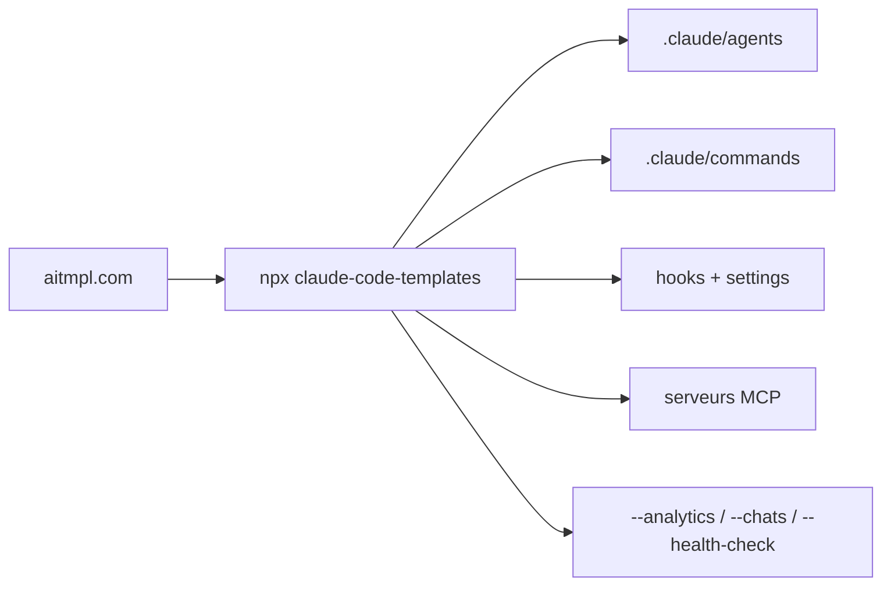

# davila7/claude-code-templates

> Catalogue installable d'agents, commandes, hooks, MCP et skills pour Claude Code.

## Le problème
Configurer Claude Code de zéro veut dire écrire ses agents, ses commandes et ses hooks un par un.
Les bonnes configurations circulent en gist et ne s'installent pas d'une commande.

## Ce que ça fait vraiment
Un `npx` installe un composant nommé : agent, commande, setting, hook, MCP ou skill.
Une interface web (aitmpl.com) sert de navigateur pour explorer le catalogue avant d'installer.
Outils annexes : analytics de session en temps réel, moniteur de conversation (avec tunnel Cloudflare), health-check, dashboard de plugins.
Le contenu est agrégé de sources tierces, chacune gardant sa licence d'origine.

## Comment c'est branché


## Essayer
```bash
npx claude-code-templates@latest
npx claude-code-templates@latest --agent development-tools/code-reviewer --yes
npx claude-code-templates@latest --command performance/optimize-bundle --yes
npx claude-code-templates@latest --health-check
npx claude-code-templates@latest --chats --tunnel
```

## Coût et pièges
Gratuit, mais chaque composant installé s'exécute dans ton agent : le contenu vient de dépôts tiers.
Le mode `--chats --tunnel` expose ton flux de conversation via un tunnel Cloudflare.

## Ce que ce n'est pas
Ce n'est pas un produit officiel Anthropic, malgré le sponsoring et les skills « officiels » repris.
Ce n'est pas homogène : 100+ composants venant de six dépôts, de qualité et de licence variables.
Le README ne déclare pas la licence du dépôt lui-même, seulement celles des contributions reprises.

## Alternatives
anthropics/skills : les skills officiels, source directe des 21 skills repris ici.
wshobson/agents : les 48 agents repris, à installer sans passer par le catalogue.
obra/superpowers : les 14 skills de workflow, également repris ici sous MIT.

## Pour toi
Un magasin à piocher, pas à installer en bloc : lis chaque composant avant de le laisser tourner chez toi.
