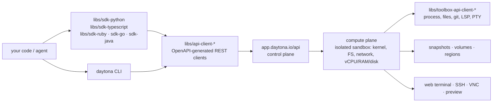

# daytonaio/daytona

> **Isolated, SDK-driven sandboxes for running agent-written code — repository discontinued.**

## The problem

Running model-generated code on your own machine, or in a hand-rolled container, exposes the
host and forces you to rebuild lifecycle management, network isolation, state persistence
between agent turns and cleanup afterwards.

## What it actually does

Daytona exposes *sandboxes*: per the README, isolated composable computers with a dedicated
kernel, filesystem, network stack and allocated vCPU / RAM / disk, OCI/Docker compatible,
starting "in under 90ms" and running Python, TypeScript and JavaScript.

Around that core the README lists state *snapshots* so an agent resumes where it stopped,
volumes, a declarative image builder, regions, and agent tools: process and code execution,
filesystem operations, git operations, LSP, pseudo terminal (PTY), computer use, an MCP
server, log streaming.

Human-facing: dashboard, web terminal, SSH, VNC, VPN, HTTP preview. Platform-facing:
organizations, API keys, limits, billing, audit logs, webhooks, network limits, OpenTelemetry
(experimental).

What the repository itself ships is mostly **clients**: SDKs and OpenAPI-generated API
clients for Python, TypeScript, Ruby, Go and Java under `libs/`, plus a CLI. The service they
call is hosted at `app.daytona.io`.

Notice at the top of the README: as of June 2026 development moved to a private codebase;
this repository gets no further updates, fixes or releases.

## How it is wired



No code-derived diagram exists for this repository: the graph is rebuilt from the README
alone, reusing the `libs/` paths it cites and its interface / control / compute plane split.

## Trying it

```bash
pip install daytona
npm install @daytona/sdk
gem install daytona
go get github.com/daytonaio/daytona/libs/sdk-go
```

The README puts three steps before any use: create an account at `app.daytona.io`, generate
an API key, then create a sandbox.

```py
from daytona import Daytona, DaytonaConfig

config = DaytonaConfig(api_key="YOUR_API_KEY")
daytona = Daytona(config)
sandbox = daytona.create()
response = sandbox.process.code_run('print("Hello World!")')
print(response.result)
```

```bash
curl 'https://app.daytona.io/api/sandbox' \
  --request POST \
  --header 'Authorization: Bearer <YOUR_API_KEY>' \
  --header 'Content-Type: application/json' \
  --data '{}'
```

```bash
daytona create
```

## Cost and gotchas

- **Account and API key are mandatory**: nothing runs without `app.daytona.io` and a key from
  the dashboard. All five SDK samples open with `api_key="YOUR_API_KEY"`.
- **Billing**: the README lists "Billing" and "Limits" among platform controls. Pricing is not
  documented in the README — check it before estimating a bill, knowing the charge is for
  isolated compute (vCPU, RAM, disk, persistence), not a plain API call.
- **Repository discontinued**: no fixes or releases since June 2026. A frozen SDK pointing at
  a service that keeps evolving privately is scheduled API drift.
- **License**: the README links a `LICENSE` file pinned to tag `v0.190.0`, but the catalogue
  records no declared license. Verify it yourself before forking, especially as the text says
  "as is and without support or warranty".
- **No self-hosting path documented** in the README: the three-plane architecture is
  described, but no control-plane install command appears.
- **OpenTelemetry is marked experimental** in the feature table.

## What it is not

- **Not a sandbox engine you install yourself.** This repository ships clients; the compute
  happens at Daytona. "Open-source platform" in the README does not mean "deployable on your
  cluster" — nothing in the README explains how.
- **Not a live project any more.** The first block says it: development moved private, the
  repository is public but frozen. You can fork it, not expect a fix.
- **Not a developer workspace for humans** despite the web terminal, SSH and VNC: the stated
  positioning is generated-code execution and agent workflows.

## Alternatives

| | When to prefer it |
|---|---|
| **e2b-dev/runtime** | The genuinely comparable neighbour: same niche of sandboxes for model-generated code. Prefer it by default, if only because it is not frozen — this repository will receive nothing more. |
| **github.com/daytona** | The address the README itself gives for current Daytona resources. Follow that if you want the product rather than this repository. |

The other catalogue neighbours (`tensorlakeai/tensorlake`, `bytedance/deer-flow`,
`omnigent-ai/omnigent`) play a different role: they provide no execution isolation.

## For you

Ignore it as a repository: a frozen SDK against a paid proprietary service is the worst of
both worlds for infrastructure. The README stays useful as a checklist of what an agent
sandbox should offer — state snapshots, network limits, PTY, audit logs — to hold against e2b
or a homemade container. The product may be worth a look; this code is not.
