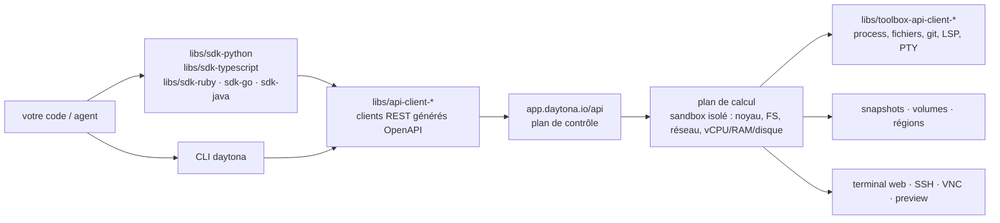

# daytonaio/daytona

> **Bacs à sable isolés, pilotés par SDK, pour exécuter du code écrit par un agent — dépôt arrêté.**

## Le problème

Faire tourner du code produit par un modèle sur sa propre machine, ou dans un conteneur monté
à la main, expose le système hôte et oblige à réinventer cycle de vie, isolation réseau,
persistance d'état entre deux tours d'agent et nettoyage après coup.

## Ce que ça fait vraiment

Daytona expose des *sandboxes* : selon le README, des ordinateurs composables isolés avec
noyau dédié, système de fichiers, pile réseau et vCPU / RAM / disque alloués, compatibles
OCI/Docker, démarrant « en moins de 90 ms » et exécutant du Python, du TypeScript et du
JavaScript.

Autour de ce cœur, le README annonce des *snapshots* d'état pour qu'un agent reprenne où il
s'était arrêté, des volumes, un constructeur déclaratif d'image, des régions, et des outils
d'agent : exécution de processus et de code, opérations de fichiers, opérations git, LSP,
terminal virtuel (PTY), *computer use*, serveur MCP, diffusion de journaux.

Côté humain : tableau de bord, terminal web, SSH, VNC, VPN, aperçu HTTP. Côté plateforme :
organisations, clés d'API, limites, facturation, journaux d'audit, webhooks, limites réseau,
OpenTelemetry (expérimental).

Le dépôt lui-même publie surtout les **clients** : SDK et clients d'API générés depuis
OpenAPI pour Python, TypeScript, Ruby, Go et Java, dans `libs/`, plus une CLI. Le service
qu'ils appellent, lui, est hébergé sur `app.daytona.io`.

Avertissement en tête de README : depuis juin 2026, le développement est passé dans une base
de code privée ; ce dépôt ne recevra plus de mise à jour, de correctif ni de version.

## Comment c'est branché



Aucun diagramme tiré du code n'existe pour ce dépôt : ce schéma est reconstruit depuis le
seul README, en reprenant les chemins `libs/` qu'il cite et sa découpe en plans interface /
contrôle / calcul.

## Essayer

```bash
pip install daytona
npm install @daytona/sdk
gem install daytona
go get github.com/daytonaio/daytona/libs/sdk-go
```

Le README fait précéder tout usage de trois étapes : créer un compte sur `app.daytona.io`,
générer une clé d'API, puis créer un bac à sable.

```py
from daytona import Daytona, DaytonaConfig

config = DaytonaConfig(api_key="YOUR_API_KEY")
daytona = Daytona(config)
sandbox = daytona.create()
response = sandbox.process.code_run('print("Hello World!")')
print(response.result)
```

```bash
curl 'https://app.daytona.io/api/sandbox' \
  --request POST \
  --header 'Authorization: Bearer <YOUR_API_KEY>' \
  --header 'Content-Type: application/json' \
  --data '{}'
```

```bash
daytona create
```

## Coût et pièges

- **Compte et clé d'API obligatoires** : rien ne tourne sans `app.daytona.io` et une clé
  générée depuis le tableau de bord. Les cinq exemples de SDK commencent tous par
  `api_key="YOUR_API_KEY"`.
- **Facturation** : le README liste « Billing » et « Limits » parmi les contrôles de
  plateforme. Le détail des tarifs n'est pas documenté dans le README — à lever avant
  d'estimer une facture, sachant que le prix porte sur du calcul isolé (vCPU, RAM, disque,
  persistance), pas sur un simple appel d'API.
- **Dépôt arrêté** : plus de correctifs ni de versions depuis juin 2026. Un SDK figé pointant
  vers un service qui, lui, continue d'évoluer en privé, c'est une dérive d'API programmée.
- **Licence** : le README renvoie à un fichier `LICENSE` épinglé sur la version `v0.190.0`,
  mais le catalogue ne relève aucune licence déclarée. À vérifier soi-même avant tout fork,
  d'autant que le texte annonce un usage « en l'état, sans support ni garantie ».
- **Pas de chemin auto-hébergé documenté** dans le README : l'architecture en trois plans est
  décrite, mais aucune commande d'installation du plan de contrôle n'y figure.
- **OpenTelemetry est marqué expérimental** dans le tableau des fonctionnalités.

## Ce que ce n'est pas

- **Ce n'est pas un moteur de bac à sable qu'on installe chez soi.** Ce dépôt livre des
  clients ; le calcul se fait chez Daytona. « Open-source platform » dans le README ne veut
  pas dire « déployable sur ton cluster » — rien dans le README ne l'explique.
- **Ce n'est plus un projet vivant.** Le premier bloc du README le dit : développement passé
  en privé, dépôt public mais gelé. On peut le forker, pas s'attendre à un correctif.
- **Ce n'est pas un environnement de développement pour humains** malgré le terminal web, SSH
  et VNC : le positionnement affiché est l'exécution de code généré et les flux d'agents.

## Alternatives

| | Quand le préférer |
|---|---|
| **e2b-dev/runtime** | Le voisin réellement comparable : même créneau du bac à sable pour code généré par un modèle. À préférer par défaut, ne serait-ce que parce qu'il n'est pas gelé — ce dépôt-ci ne recevra plus rien. |
| **github.com/daytona** | Adresse donnée par le README lui-même pour les ressources Daytona actuelles. À suivre si l'on tient au produit plutôt qu'à ce dépôt. |

Les autres voisins du catalogue (`tensorlakeai/tensorlake`, `bytedance/deer-flow`,
`omnigent-ai/omnigent`) ne jouent pas le même rôle : ils ne fournissent pas d'isolation
d'exécution.

## Pour toi

À ignorer en tant que dépôt : un SDK figé vers un service propriétaire payant est le pire des
deux mondes pour un socle d'infrastructure. Le README reste utile comme liste de contrôle de
ce qu'un bac à sable d'agent doit offrir — snapshots d'état, limites réseau, PTY, journaux
d'audit — à confronter à e2b ou à un conteneur maison. Le produit peut valoir le détour ; ce
code-là, non.
