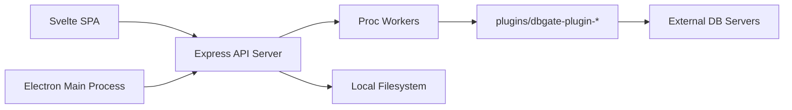

# dbgate/dbgate

> Client de bases SQL et NoSQL multiplateforme : bureau, web ou Docker.

## Le problème
Travailler sur plusieurs bases (Postgres, MongoDB, Redis…) oblige à multiplier les clients.

## Ce que ça fait vraiment
Navigation et édition de données, filtres façon Excel, édition de schéma, comparaison de structures, diagramme ER.
Éditeur SQL avec complétion, concepteur visuel de requêtes, éditeur de scripts Mongo, vue arborescente Redis.
Import et export CSV, Excel, JSON, NDJSON, XML ; graphiques ; chat IA sur la base.
Architecture à plugins ; front Svelte, API Express, application Electron.

## Comment c'est branché


## Essayer
```bash
yarn
yarn start
```

## Coût et pièges
Gratuit (GPL-3.0) ; une licence Premium payante existe. 461 issues ouvertes.

## Ce que ce n'est pas
Pas un outil de migration de schéma versionné ni un ORM.

## Alternatives
Aucune alternative nommée dans le README.

## Pour toi
À surveiller comme client de bases unique pour explorer Postgres, Mongo et Redis ; l'export NDJSON et les scripts Node sont un plus pour la data.
