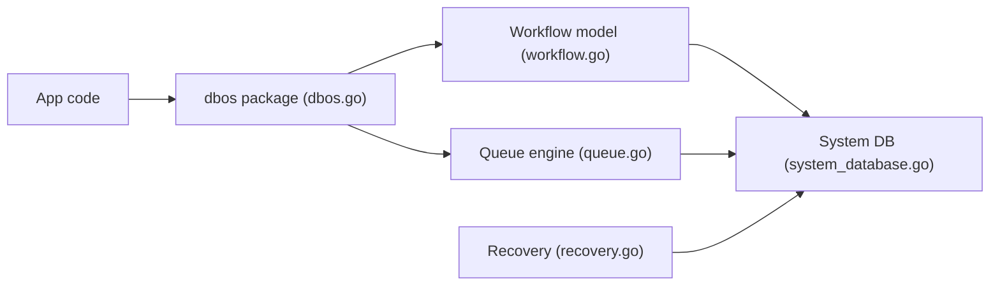

# dbos-inc/dbos-transact-golang

> Bibliothèque Go qui rend des workflows durables en enregistrant leur état dans Postgres, pour développeurs backend.

## Le problème
Un pipeline ou un paiement interrompu par un crash repart de zéro sans logique de reprise lourde ni orchestrateur externe.

## Ce que ça fait vraiment
Des fonctions Go ordinaires sont enregistrées comme workflows et étapes ; chaque étape est checkpointée dans Postgres et le workflow reprend au dernier pas terminé. La même base porte des files durables, des notifications exactement-une-fois, des planifications cron et des sleeps durables. Aucun broker ni serveur d'orchestration séparé.

## Comment c'est branché

## Essayer
Aucune commande d'installation dans le README, qui renvoie au quickstart. L'exemple Go lit `DBOS_SYSTEM_DATABASE_URL` et importe `github.com/dbos-inc/dbos-transact-golang/dbos`.

## Coût et pièges
Une base Postgres est requise. Les workflows doivent être écrits pour être déterministes et reprenables ; le débit est borné par ce que Postgres supporte.

## Ce que ce n'est pas
Pas un orchestrateur de données avec connecteurs prêts à l'emploi ; pas un broker à très haut débit. Uniquement Go ici.

## Alternatives
- Temporal : à préférer si vous ne voulez pas de Postgres ou avez besoin d'un autre langage.
- Airflow : pour son écosystème de connecteurs.
- Celery / BullMQ : pour un débit très élevé sans durabilité.

## Pour toi
À surveiller : intéressant pour des pipelines ou agents à reprise sur incident, mais réservé à une stack Go ; l'équivalent Python n'est pas ici.
